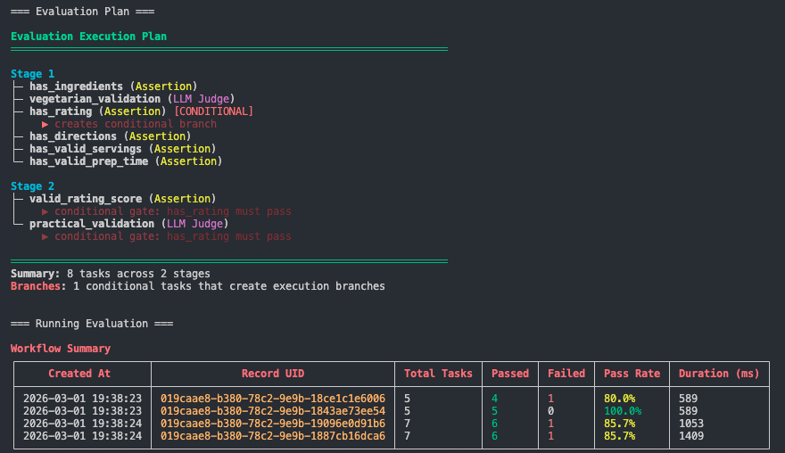
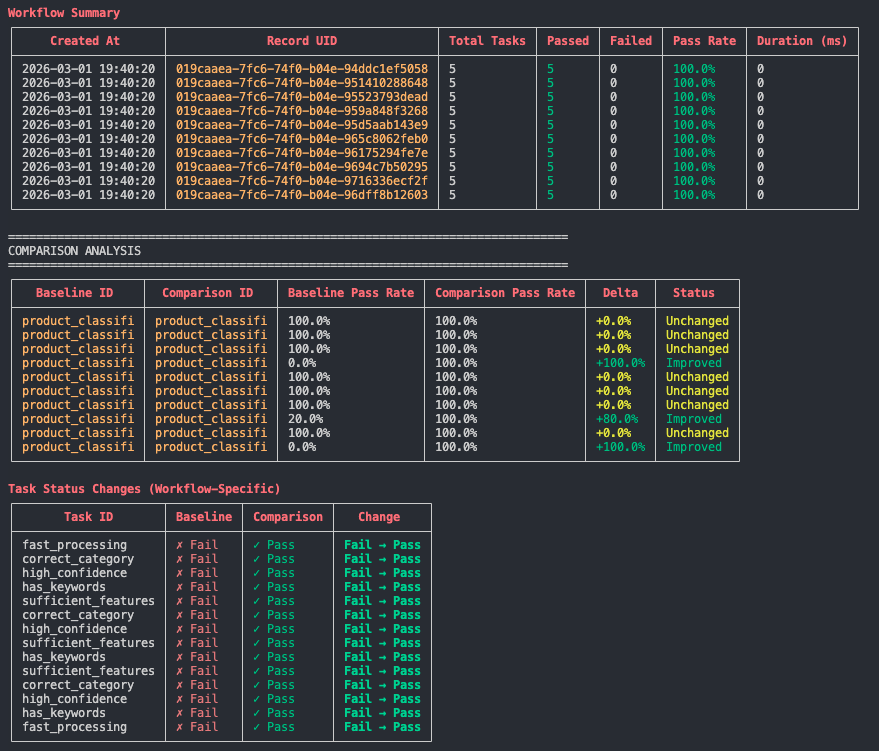

<h1 align="center">
  <br>
  
  <br>
</h1>

<h2 align="center"><b>Developer-First ML Monitoring, Observability, and GenAI Evaluation</b></h2>

<h2 align="center"><a href="https://demml.github.io/scouter/">Doc Site</h2>

## Table of Contents

- [What is it?](#what-is-it)
- [Why Use It?](#why-use-it)
- [Developer-First Experience](#developer-first-experience)
- [Production Ready](#production-ready)
- [Quick Start](#quick-start)
  - [Traditional Monitoring](#traditional-monitoring)
  - [Distributed Tracing](#distributed-tracing)
  - [GenAI Evaluation](#genai-evaluation)
    - [Offline Evaluation](#offline-evaluation--regression-testing-before-you-ship)
    - [Online Evaluation](#online-evaluation--continuous-production-monitoring)
- [Supported Data Types](#supported-data-types)
- [Architecture](#architecture)

---

## **What is it?**

`Scouter` is a developer-first monitoring and observability toolkit for ML and AI workflows. It covers the full spectrum of production AI observability — from traditional data and model drift detection, to distributed tracing, to online and offline GenAI evaluation. Built entirely in `Rust` with `Postgres` as its primary data store, and exposed to Python via PyO3-generated stubs.

## **Why Use It?**

Because you deploy ML and AI services that need to be monitored, and you want a single toolkit that handles drift detection, distributed tracing, and GenAI evaluation — without stitching together five different libraries.

## Check our current roadmap and tasks

[open tasks](https://github.com/orgs/demml/projects/4)


### Developer-First Experience
- **Zero-friction Integration** - Drop into existing ML and AI workflows in minutes
- **Type-safe by Design** - The entire codebase is Rust<sup>*</sup>. Python users interact via PyO3-generated stubs. Catch errors before they hit production
- **One Dependency** - Monitoring, tracing, and GenAI evaluation in a single library. No need to install multiple libraries
- **Standardized Patterns** - Out of the box patterns for drift monitoring, distributed tracing, and LLM evaluation
- **Offline → Online Parity** - Define your GenAI evaluation tasks once; run them as offline regression tests and as live production monitors
- **Integrations** - Works out of the box with any Python API framework. Event-driven transport support for `Kafka`, `RabbitMQ`, and `Redis`

### Production Ready
- **High-Performance Server** - Built entirely in Rust with Axum for speed, reliability, and concurrency
- **Cloud-Ready** - Native support for AWS, GCP, Azure
- **Modular Design** - Use what you need, leave what you don't
- **Alerting and Monitoring** - Built-in alerting integrations with `Slack` and `OpsGenie` to notify you and your team when an alert is triggered
- **Data Retention** - Built-in data retention policies to keep your database clean and performant
- **OpenTelemetry Compatible** - Drop Scouter in as a TracerProvider; spans flow to both Scouter's backend and any external OTEL collector

<sup>
* Scouter is written entirely in Rust and exposed via a Python API built with PyO3.
</sup>

## Quick Start

Scouter follows a client and server architecture — the client is a lightweight Python library (backed by Rust) that drops into any application, and the server handles data collection, storage, drift computation, tracing, and evaluation.

### Install Scouter
```bash
pip install scouter-ml
```

---

### Traditional Monitoring

#### Population Stability Index (PSI) — Detect Distribution Shift

```python
import numpy as np
import pandas as pd
import uvicorn
from contextlib import asynccontextmanager
from fastapi import FastAPI, Request
from pydantic import BaseModel
from scouter import (
    CommonCrons,
    Drifter,
    HttpConfig,
    PsiAlertConfig,
    PsiDriftConfig,
    ScouterClient,
    ScouterQueue,
)
from scouter.util import FeatureMixin


class PredictRequest(BaseModel, FeatureMixin):
    feature_1: float
    feature_2: float
    feature_3: float


def create_psi_profile(data: pd.DataFrame):
    drifter = Drifter()
    client = ScouterClient()

    psi_config = PsiDriftConfig(
        space="production",
        name="my_model",
        version="0.0.1",
        alert_config=PsiAlertConfig(
            schedule=CommonCrons.Every6Hours,
            features_to_monitor=["feature_1", "feature_2"],
        ),
    )

    profile = drifter.create_drift_profile(data, psi_config)
    client.register_profile(profile=profile, set_active=True)
    return profile.save_to_json()


if __name__ == "__main__":
    profile_path = create_psi_profile(training_data)

    @asynccontextmanager
    async def lifespan(fast_app: FastAPI):
        fast_app.state.queue = ScouterQueue.from_path(
            path={"my_model": profile_path},
            transport_config=HttpConfig(),
        )
        yield
        fast_app.state.queue.shutdown()

    app = FastAPI(lifespan=lifespan)

    @app.post("/predict")
    async def predict(request: Request, payload: PredictRequest):
        # Non-blocking insert — <1µs latency impact
        request.app.state.queue["my_model"].insert(payload.to_features())
        return {"message": "success"}

    uvicorn.run(app, host="0.0.0.0", port=8888)
```

#### Custom Metrics — Monitor Any Named Metric

```python
from scouter import (
    AlertThreshold,
    CommonCrons,
    CustomDriftProfile,
    CustomMetric,
    CustomMetricAlertConfig,
    CustomMetricDriftConfig,
    ScouterClient,
)

custom_config = CustomMetricDriftConfig(
    space="production",
    name="model_metrics",
    version="0.0.1",
    alert_config=CustomMetricAlertConfig(schedule=CommonCrons.EveryHour),
)

custom_profile = CustomDriftProfile(
    config=custom_config,
    metrics=[
        CustomMetric(name="mae", value=10.0, alert_threshold=AlertThreshold.Above),
        CustomMetric(name="f1_score", value=0.85, alert_threshold=AlertThreshold.Below),
    ],
)

client = ScouterClient()
client.register_profile(custom_profile)
```

---

### Distributed Tracing

Scouter implements the OpenTelemetry `BaseInstrumentor` interface. Drop it in as a `TracerProvider` alongside any existing OTEL stack, or use it standalone.

```python
from scouter.tracing import ScouterInstrumentor, get_tracer, init_tracer

# Register as the global OTEL TracerProvider
# Any OTEL auto-instrumentation library (FastAPI, httpx, etc.) will route spans through Scouter
ScouterInstrumentor().instrument()

tracer = get_tracer(name="my-service")

@tracer.span("process_request")
async def process_request(payload: dict) -> dict:
    # Inputs, outputs, and exceptions are captured automatically
    return {"result": "ok"}
```

Forward spans to an external OTEL collector in addition to Scouter's backend:

```python
from scouter import init_tracer, HttpSpanExporter, OtelExportConfig

init_tracer(
    service_name="my-service",
    exporter=HttpSpanExporter(
        export_config=OtelExportConfig(endpoint="http://otel-collector:4318")
    ),
)
```

---

### GenAI Evaluation

Scouter provides three evaluation primitives that work identically in offline batch tests and online production monitors:

- **`AssertionTask`** — Deterministic rule-based checks. 50+ `ComparisonOperator` values covering numeric, string, collection, length, type, and format validation. Zero cost, minimal latency.
- **`LLMJudgeTask`** — LLM-powered semantic evaluation (relevance, quality, hallucination, tone). Structured output via Pydantic. Supports OpenAI, Anthropic, and Google providers.
- **`TraceAssertionTask`** — Validates properties of distributed traces captured by Scouter's tracing system: span execution order, retry counts, token budgets, latency SLAs, error counts, and model attribution. Zero cost; bridges tracing and evaluation in the same task graph.

Tasks support dependency graphs and conditional execution gates, so you can build multi-stage evaluation pipelines and prevent expensive LLM calls when upstream checks fail.

#### Offline Evaluation — Regression Testing Before You Ship

Run batch evaluations against a test set with conditional task chains and dependency graphs.

```python
from scouter.evaluate import (
    AssertionTask,
    ComparisonOperator,
    EvalDataset,
    LLMJudgeTask,
)
from scouter.genai import Prompt, Provider, Score
from scouter.queue import EvalRecord

quality_prompt = Prompt(
    messages=(
        "Rate the quality of this response on a scale of 1-5.\n\n"
        "Query: ${query}\nResponse: ${response}"
    ),
    model="gemini-2.5-flash-lite",
    provider=Provider.Gemini,
    output_type=Score,
)

tasks = [
    # Fast gate — skip the LLM call if response is empty
    AssertionTask(
        id="not_empty",
        context_path="response",
        operator=ComparisonOperator.HasLengthGreaterThan,
        expected_value=10,
        condition=True,
    ),
    # LLM judge — only runs if not_empty passes
    LLMJudgeTask(
        id="quality_check",
        prompt=quality_prompt,
        expected_value=4,
        context_path="score",
        operator=ComparisonOperator.GreaterThanOrEqual,
        depends_on=["not_empty"],
        description="Quality score must be >= 4/5",
    ),
]

records = [
    EvalRecord(context={"query": q, "response": r})
    for q, r in test_pairs
]

dataset = EvalDataset(records=records, tasks=tasks)
dataset.print_execution_plan()  # Preview before running
results = dataset.evaluate()
results.as_table()              # Summary view
results.as_table(show_tasks=True)  # Per-task breakdown
```

**Trace Assertion Example — Validate How Your Agent Executed**

Use `TraceAssertionTask` to evaluate properties of spans captured by Scouter's tracing system. Enforce execution order, retry limits, token budgets, and latency SLAs in the same task graph as your LLM judges.

```python
from scouter.evaluate import (
    TraceAssertionTask,
    TraceAssertion,
    AggregationType,
    SpanFilter,
    ComparisonOperator,
)

trace_tasks = [
    # Verify the agent ran steps in the correct order
    TraceAssertionTask(
        id="execution_order",
        assertion=TraceAssertion.span_sequence(["retrieve", "rerank", "generate"]),
        operator=ComparisonOperator.Equals,
        expected_value=True,
        condition=True,  # Gate — skip downstream checks if order is wrong
        description="Verify correct pipeline execution order",
    ),
    # Enforce token budget across all LLM calls
    TraceAssertionTask(
        id="token_budget",
        assertion=TraceAssertion.span_aggregation(
            filter=SpanFilter.by_name_pattern(r"llm\..*"),
            attribute_key="token_count",
            aggregation=AggregationType.Sum,
        ),
        operator=ComparisonOperator.LessThan,
        expected_value=10_000,
        depends_on=["execution_order"],
        description="Total tokens must stay under budget",
    ),
    # Enforce latency SLA
    TraceAssertionTask(
        id="latency_sla",
        assertion=TraceAssertion.trace_duration(),
        operator=ComparisonOperator.LessThan,
        expected_value=5000.0,  # 5 seconds in ms
        depends_on=["execution_order"],
        description="End-to-end trace must complete within 5s",
    ),
]
```

<table>
  <tr>
    <td align="center"><b>Offline Evaluation</b></td>
    <td align="center"><b>Regression Testing (Comparison)</b></td>
  </tr>
  <tr>
    <td></td>
    <td></td>
  </tr>
</table>

#### Online Evaluation — Continuous Production Monitoring

Register the same task definitions as a production drift profile. The server samples traffic, runs evaluations asynchronously, and alerts when pass rates drop.

```python
from scouter import (
    AlertCondition,
    AlertThreshold,
    AgentAlertConfig,
    AgentEvalConfig,
    ScouterClient,
    SlackDispatchConfig,
)
from scouter.evaluate import AgentEvalProfile

alert_config = AgentAlertConfig(
    dispatch_config=SlackDispatchConfig(channel="#ml-alerts"),
    schedule="0 */6 * * *",
    alert_condition=AlertCondition(
        baseline_value=0.80,  # Alert if pass rate drops below 75% (0.80 - 0.05)
        alert_threshold=AlertThreshold.Below,
        delta=0.05,
    ),
)

config = AgentEvalConfig(
    space="production",
    name="support_agent",
    version="1.0.0",
    sample_ratio=0.10,  # Evaluate 10% of requests
    alert_config=alert_config,
)

# Reuse the same tasks defined for offline regression testing
profile = AgentEvalProfile(config=config, tasks=tasks)

client = ScouterClient()
client.register_profile(profile, set_active=True)

# At request time — non-blocking, sampled automatically by the server
record = EvalRecord(context={"query": user_query, "response": model_output})
queue["support_agent"].insert(record)
```

---

## Supported Data Types

Scouter accepts **Pandas DataFrames**, **Polars DataFrames**, **NumPy 2D arrays**, and **Pydantic models** out of the box.

## Architecture

```
Client (Python stubs / PyO3 → Rust)
    └── ScouterQueue  (<1µs non-blocking inserts)
        ├── HTTP (default)
        ├── gRPC
        └── Kafka / RabbitMQ / Redis  (feature-gated)

Server (Rust / Axum + Tonic)
    ├── HTTP API  — profile registration, drift queries
    ├── gRPC      — high-throughput queue ingestion
    ├── PostgreSQL — storage + migrations
    └── Background workers
        ├── Drift Executor  — scheduled PSI/SPC/custom checks + alerts
        └── GenAI Poller    — async evaluation task execution + alerting
```

## Contributing

See [CONTRIBUTING.md](CONTRIBUTING.md).
