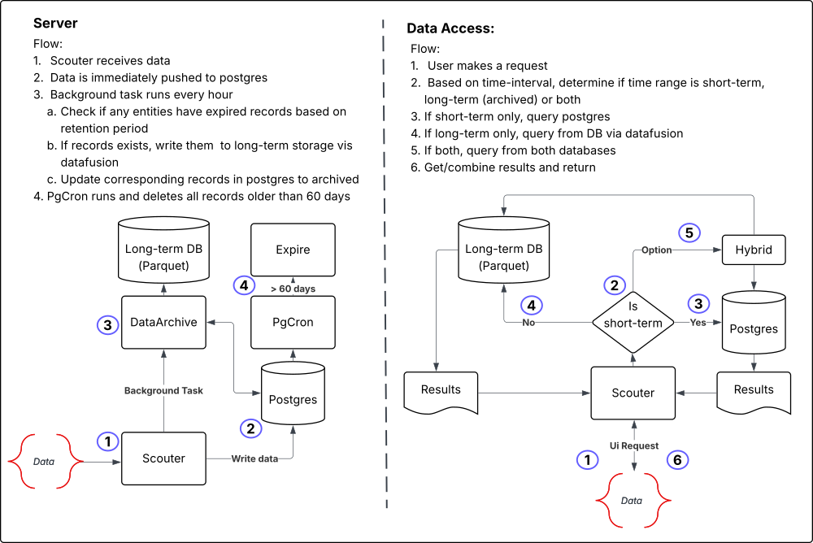

# Technical Component Specification: Data Archive

## Overview
The data archive component and architecture is meant to provide a way to maintain database performance, while retaining data in a long-term storage solution.  Importantly, Scouter focuses on providing real-time monitoring capabilities and alerting. And while most of this relies on having short-term data (defined as 60 days), there are some use cases where a user may want to visualize or audit data from longer periods of time.  This component is meant to provide a way to do that.

TLDR: Scouter deletes all records > 60 days old in order to maintain database performance, so we need a retention strategy for expired data in the event a user needs access to it.


## How it works:

`ScouterServerConfig` will now load a default `ObjectStorageSettings` struct on startup. This struct serves as a configuration for the object storage provider.

```rust
pub struct ObjectStorageSettings {
    pub storage_uri: String,
    pub storage_type: StorageType,
    pub region: String, // this is aws specific
}
```

Accepted environment variables are:
- `SCOUTER_STORAGE_URI`: The URI for the object storage provider. This must be one of the following:
  - `s3://<bucket-name>` for AWS S3
  - `gs://<bucket-name>` for Google Cloud Storage
  - `az://<container-name>` for Azure Blob Storage
  -  `./scouter-storage` for local storage (default if not set)
  
- `AWS_REGION`: The AWS region for the object storage provider. This is only required if the `SCOUTER_STORAGE_URI` is set to `s3://<bucket-name>`. It defaults to `us-east-1` if not set.

In addition to `ObjectStorageSettings`, `DatabaseSettings` now takes on an additional environment variable `DATA_RETENTION_PERIOD` which indicates how long data should be retained in the database before moving it to long-term storage. Note this is only for **copying** data to long-term storage. The actual deletion of data is still handled by `pgCron`. The default value is 60 days.

```rust

## Component Architecture



## Implementation Details

The data archive component itself is comprised of a few key parts:

1. **Scouter Dataframe**: This is a crate that defines the arrow datafusion, parquet and object store interfaces for reading and writing data to an from long-term storage. It also contains drift-specific logic that is implement via traits.

### Primary Interface

```rust
pub enum ParquetDataFrame {
   CustomMetric(CustomMetricDataFrame),
   Psi(PsiDataFrame),
   Spc(SpcDataFrame),
}
```

The `ParquetDataFrame` enum is the primary interface for the data archive component. It allows for different types of data frames to be handled in a uniform way. Each variant of the enum corresponds to a specific type of data frame, such as `CustomMetric`, `Psi`, or `Spc`.

It's primary methods for reading and writing data are:

```rust
pub async fn write_parquet(
   &self,
   rpath: &str,
   records: ServerRecords,
) -> Result<(), DataFrameError> 
```

```rust
pub async fn get_binned_metrics(
   &self,
   path: &str,
   bin: &f64,
   start_time: &DateTime<Utc>,
   end_time: &DateTime<Utc>,
   space: &str,
   name: &str,
   version: &str,
) -> Result<DataFrame, DataFrameError>
```

2. **Scouter Server DataArchiver**: Upon startup, the Scouter server will create a `DataArchiver` instance and start a background worker that will run every hour. This worker will check for any expired data in the database and move it to long-term storage. The `DataArchiver` will use the `ParquetDataFrame` interface to read and write data.

```rust
pub async fn setup_background_data_archive_workers(
    db_pool: &Pool<Postgres>,
    config: &Arc<ScouterServerConfig>,
    shutdown_rx: tokio::sync::watch::Receiver<()>,
) -> AnyhowResult<()> {
    DataArchiver::start_workers(db_pool, shutdown_rx, config).await?;
    info!("✅ Started data archive workers");
    Ok(())
}
```

The primary method for the background worker is `archive_expired_data`, which will check for any expired data in the database and move it to long-term storage. It iterates over each drift type and processes records according to their trait implementations.

```rust
pub async fn archive_old_data(
    db_pool: &Pool<Postgres>,
    config: &Arc<ScouterServerConfig>,
) -> Result<ArchiveRecord, ScouterError>
```

```rust
async fn process_record_type(
    db_pool: &Pool<Postgres>,
    record_type: &RecordType,
    config: &Arc<ScouterServerConfig>,
) -> Result<bool, ScouterError>
```

```rust
async fn get_entities_to_archive(
    db_pool: &Pool<Postgres>,
    record_type: &RecordType,
    retention_period: &i32,
) -> Result<Vec<Entity>, ScouterError>
```

```rust
async fn get_data_to_archive(
    tx: &mut Transaction<'_, Postgres>,
    record_type: &RecordType,
    entity: &Entity,
) -> Result<ServerRecords, ScouterError>
```


```rust
async fn update_entities_to_archived(
    tx: &mut Transaction<'_, Postgres>,
    record_type: &RecordType,
    entity: &Entity,
) -> Result<(), ScouterError>`
```

## Dependencies

- **Primary External Crates**
  - `arrow-array`
  - `datafusion`
  - `object_store`
  - `parquet`


## Performance Considerations

1. **Asynchronous Processing**
   - Non-blocking
   - Async database operations

---

*Version: 1.0*  
*Last Updated: 2025-04-23*  
*Component Owner: Steven Forrester*