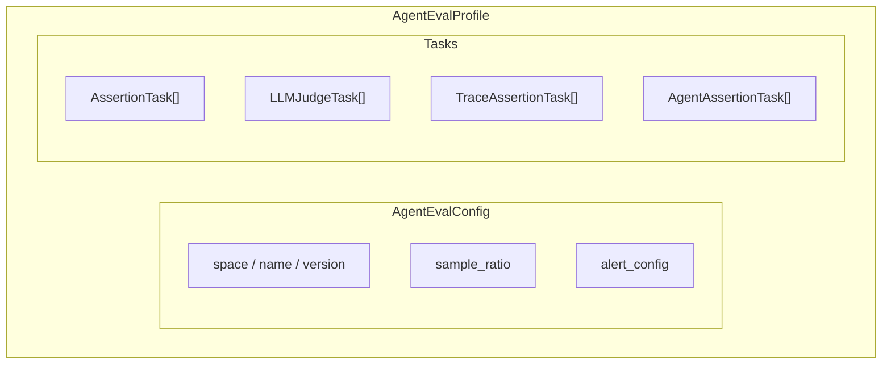
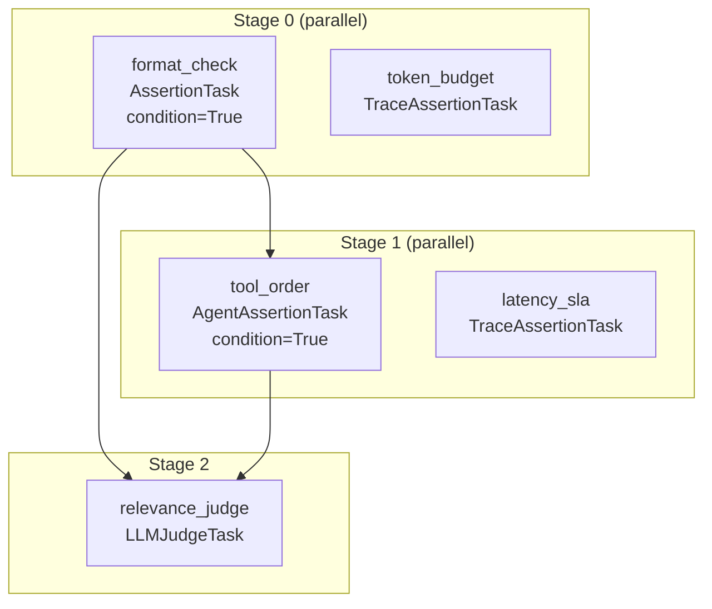

Scouter's evaluation system is built from a small set of composable primitives. An `AgentEvalProfile` packages configuration and tasks into a single unit. Four task types cover different evaluation concerns. Tasks compose into dependency DAGs with conditional gates that control execution flow and cost.

This page covers the primitives and how they fit together. For full API reference with code examples, see [Evaluation tasks](/scouter/agents/tasks/).

> For the problem this solves, see the [evaluation platform overview](/scouter/evaluation-platform/).

---

## The evaluation unit: AgentEvalProfile

A profile is a config block paired with a set of tasks. The config carries identity, sampling, and alerting. The tasks define what to evaluate.

Profile identity uses the same `(space, name, version)` triple as drift profiles across Scouter. This is intentional: one identity model for the whole system. Profiles are versioned and registered with the server. Multiple versions can coexist, and profiles can be activated or deactivated independently.

The same profile definition works in both offline and online modes. In offline mode, an `alias` field links a profile to a specific sub-agent in your pipeline. In online mode, the profile registers on the server and tasks execute asynchronously against sampled production records. No changes to the task definitions between modes.

---

## Four task types

Each task type evaluates a different dimension of agent behavior. They differ in what they check, how much they cost, and when you should reach for them.

| Task type | What it checks | Cost | Latency |
|---|---|---|---|
| `AssertionTask` | Values in evaluation context (structure, thresholds, formats) | Zero (no external calls) | Nanoseconds (pure Rust) |
| `LLMJudgeTask` | Semantic quality via LLM (relevance, faithfulness, tone) | One LLM API call per eval | Provider-dependent (100ms to 5s) |
| `TraceAssertionTask` | OpenTelemetry span properties (order, duration, retries, tokens) | Zero (spans already in memory) | Nanoseconds (pure Rust) |
| `AgentAssertionTask` | Agent tool calls and response structure (vendor-agnostic) | Zero (no external calls) | Nanoseconds (pure Rust) |

Three of four task types are free and nanosecond-fast (pure Rust parsing, no external calls). The expensive one (LLM judge) is the one you want to run last, after cheap checks have already filtered out obvious failures. That layering is the whole point of the dependency DAG system covered below.

### AssertionTask: deterministic rule-based validation

Evaluates values extracted from the evaluation context against expected conditions using comparison operators.

`context_path` uses dot and bracket notation to reach into arbitrarily nested JSON: `response.items[0].status`, `metadata.scores[2].value`. Path extraction supports up to 32 segments and 512 characters.

Template variable substitution lets you resolve expected values from context at evaluation time. Write `${ground_truth.answer}` as your expected value, and the engine pulls the actual value from the record's context before comparing. This is how you do ground truth comparison without hardcoding expected values into task definitions.

Use for: structure validation, threshold checks, format validation (email, URL, UUID, ISO 8601, JSON), fast pre-filtering before expensive LLM judges.

### LLMJudgeTask: semantic evaluation via LLM

Sends a prompt to an LLM, extracts a field from the structured response, and compares it against an expected value. The prompt supports the same `${field.path}` template variables, so you can inject context (the agent's output, ground truth, conversation history) directly into the judge prompt.

Supports OpenAI, Anthropic, and Google as judge providers. Model and provider are configurable per task. Structured output uses Pydantic models on the Python side (a `Score` with `score` and `reason` fields, for example).

`max_retries` (default 3) handles transient failures from rate limits and network issues.

Use for: relevance scoring, faithfulness checks, hallucination detection, tone evaluation, any quality dimension that requires semantic understanding.

### TraceAssertionTask: validation on OpenTelemetry spans

Operates on trace data captured by Scouter's tracing system. Two categories:

Span-level assertions require a `SpanFilter` to select which spans to evaluate. Seven assertion types: `span_exists`, `span_count`, `span_duration`, `span_attribute`, `span_aggregation`, `span_sequence`, `span_set`.

Trace-level assertions operate on the full trace without filtering. Six types: `trace_duration`, `trace_span_count`, `trace_error_count`, `trace_service_count`, `trace_max_depth`, `trace_attribute`.

`SpanFilter` is composable. Start with a base filter (`by_name`, `by_name_pattern` for regex, `with_attribute`, `with_attribute_value`, `with_status`, `with_duration`) and combine with `.and_()` and `.or_()`. Regex patterns are pre-compiled at evaluation time; max pattern length is 512 characters.

`AggregationType` covers the standard set: Count, Sum, Average, Min, Max, First, Last. Apply these to numeric span attributes across filtered spans.

Use for: execution order verification, retry limit enforcement, token budgets across spans, latency SLA checks, error detection, model verification per span.

### AgentAssertionTask: validation on agent tool calls and response structure

Deterministic assertions on LLM agent responses. No additional LLM call required. Fourteen `AgentAssertion` variants split into two groups:

Tool call assertions (7):

- `tool_called` / `tool_not_called`: was this tool invoked?
- `tool_called_with_args`: partial match on arguments (recursive, so `{"item": {"name": "widget"}}` matches a superset)
- `tool_call_sequence`: ordered subsequence matching (non-contiguous; `[search, rank]` matches `[search, filter, rank, respond]`)
- `tool_call_count`: how many times was this tool called?
- `tool_argument`: extract a specific argument value by key
- `tool_result`: extract the result from a tool call

Response assertions (7):

- `response_content`: text content from the response
- `response_model`: which model produced this response
- `response_finish_reason`: why the model stopped generating
- `response_input_tokens` / `response_output_tokens` / `response_total_tokens`: token counts
- `response_field`: dot-notation escape hatch into raw response JSON

Vendor auto-detection parses the response JSON without requiring a provider parameter. Detection signals: `choices` array means OpenAI, `stop_reason` with `content` array means Anthropic, `candidates` array means Google/Vertex. You can override with an explicit `provider` if needed, but auto-detection handles the common case.

Use for: verifying correct tools were called, argument validation, call ordering, token budget enforcement, response structure checks, model verification.

---

## Comparison operators

46 operators across six categories. Enough to express real-world validation rules without reaching for custom code.

| Category | Operators | Examples |
|---|---|---|
| Numeric | Equals, NotEqual, GreaterThan, GreaterThanOrEqual, LessThan, LessThanOrEqual, InRange, NotInRange, IsPositive, IsNegative, IsZero, ApproximatelyEquals | Threshold checks, score ranges, token budgets |
| String | Contains, NotContains, StartsWith, EndsWith, Matches, MatchesRegex, ContainsWord, IsAlphabetic, IsAlphanumeric, IsLowerCase, IsUpperCase | Content validation, format checks, pattern matching |
| Collection | ContainsAll, ContainsAny, ContainsNone, IsEmpty, IsNotEmpty, HasUniqueItems, SequenceMatches | Tool call verification, tag validation |
| Length | HasLengthEqual, HasLengthGreaterThan, HasLengthLessThan, HasLengthGreaterThanOrEqual, HasLengthLessThanOrEqual | Response length constraints |
| Type | IsNumeric, IsString, IsBoolean, IsNull, IsArray, IsObject | Schema validation |
| Format | IsEmail, IsUrl, IsUuid, IsIso8601, IsJson | Output format enforcement |

The comparison engine handles type coercion automatically. Floats and ints normalize for comparison (`300.0` equals `300`). Strings parse to numbers when the other operand is numeric. Arrays extract their length for `HasLength*` operators. Template variable substitution (`${field.path}`) works with all operators.

For the full operator reference, see [Evaluation tasks](/scouter/agents/tasks/).

---

## Dependency DAGs and conditional gates

Tasks declare dependencies with `depends_on: ["task_id"]`. The engine topologically sorts all tasks (Kahn's algorithm) into an `ExecutionPlan` with numbered stages. Tasks within a stage have no mutual dependencies and execute in parallel via Tokio's `JoinSet`. Stages execute sequentially.

In this example, `format_check` and `token_budget` run in parallel (Stage 0, no dependencies). `tool_order` depends on `format_check`, so it waits for Stage 1. `relevance_judge` depends on both `format_check` and `tool_order`, so it runs in Stage 2. Meanwhile, `token_budget` and `latency_sla` run independently in their own stages.

### How conditional gates work

Set `condition=True` on any task to make it a gate. If the gate's assertion fails, all downstream tasks that depend on it are skipped. Skipped, not failed. Skipped tasks are excluded from pass/fail metrics entirely.

This is the cost control mechanism. If a cheap format check fails, the expensive LLM judge never runs. You save the API call, the latency, and the tokens.

The skip logic cascades: if Task A is a gate and fails, Task B (depends on A) gets skipped. If Task C depends on Task B, it also gets skipped. One failed gate at the top can short-circuit an entire branch of the DAG.

Tasks without `condition=True` are regular dependencies. Their downstream tasks still run regardless of pass/fail; they just get access to the upstream result in their scoped context.

Each task sees the base evaluation context plus the outputs of its declared dependencies. Not the full context of every upstream task. This scoping is intentional: it keeps task inputs predictable and avoids accidental coupling between unrelated branches of the DAG.

For detailed gate usage with code examples, see [Conditional gates](/scouter/agents/gates/).

### Circular dependency detection

The topological sort validates the DAG during profile construction. If you create a circular dependency (`A depends on B, B depends on A`), profile creation fails with a `CircularDependency` error. This is caught at definition time, not at evaluation time.

---

## How task types compose

The four task types map to three evaluation layers, and the layering reflects a real cost/value hierarchy:

1. **What did the model return?** `AssertionTask` validates structure, values, and formats. Zero cost. Run these first.
2. **How did the model produce it?** `TraceAssertionTask` checks span execution order, retries, latency, and token counts. `AgentAssertionTask` checks tool calls, arguments, and response structure. Also zero cost.
3. **Is the output good?** `LLMJudgeTask` evaluates semantic quality (relevance, faithfulness, tone). Costs one LLM call. Run this last.

Gates cascade through the layers: structural validation gates execution validation, which gates quality evaluation. If the response is malformed JSON, there is no point checking whether the agent called the right tools. If the tools were called in the wrong order, there is no point asking an LLM judge whether the output is relevant.

Independent checks run in parallel regardless of layer. A token budget check (TraceAssertionTask) does not need to wait for the relevance judge (LLMJudgeTask). The DAG captures this naturally: independent tasks land in the same stage and execute concurrently.

| Question | Task type |
|---|---|
| Is the response valid JSON? | AssertionTask (IsJson) |
| Does the output contain required fields? | AssertionTask (context_path + Contains/Equals) |
| Is the confidence score above threshold? | AssertionTask (GreaterThan) |
| Was the right tool called? | AgentAssertionTask (tool_called) |
| Were tools called in the correct order? | AgentAssertionTask (tool_call_sequence) |
| Did the agent stay within token budget? | AgentAssertionTask (response_total_tokens + LessThan) |
| Did the retriever span execute before the synthesizer? | TraceAssertionTask (span_sequence) |
| Were there any error spans? | TraceAssertionTask (trace_error_count + Equals 0) |
| Did any span exceed the latency SLA? | TraceAssertionTask (span_duration + LessThan) |
| Is the summary relevant to the query? | LLMJudgeTask |
| Is the response faithful to the source documents? | LLMJudgeTask |
| Does the tone match the persona? | LLMJudgeTask |

The rest of this technical overview covers how these building blocks execute in [offline evaluation](/scouter/evaluation-platform/offline-evaluation/) and [online evaluation](/scouter/evaluation-platform/online-evaluation/).
