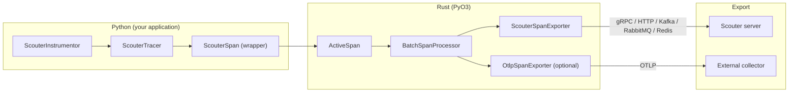
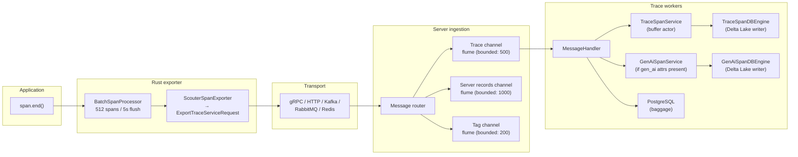
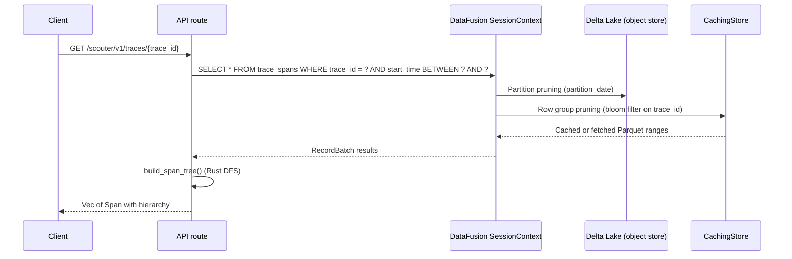
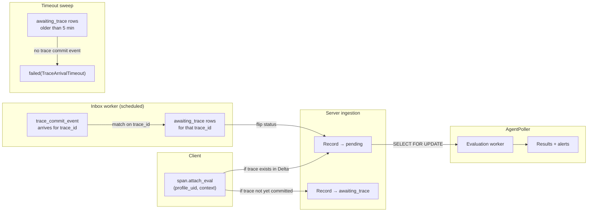

Agents are multi-step pipelines. The final output tells you *what* happened. Traces tell you *how*. Without them, you can't answer: did the retriever call the right API? Did the agent retry too many times? Was the right model used? Did latency exceed the SLA? Did total token usage blow the budget?

Scouter treats traces as first-class evaluation data, not a separate observability concern. `TraceAssertionTask` runs assertions directly on OpenTelemetry span properties, and records attached to spans via `span.attach_eval()` correlate with traces automatically. The same span that shows up in your trace viewer feeds into your evaluation pipeline.

For tracing setup and instrumentation, see [Distributed tracing](/tracing/overview/). For the full task type reference, see [Building blocks](/evaluation-platform/eval-profiles-and-tasks/).

> For system-wide ingestion pipeline details, see [Architecture](/architecture/overview/).

---

## OTEL compatibility and the Rust/Python boundary

Scouter's tracing is a standard OpenTelemetry implementation, not a proprietary format. `ScouterInstrumentor` implements the OTEL `BaseInstrumentor` interface and registers as the global `TracerProvider`. Any OTEL auto-instrumentation library (httpx, FastAPI, Starlette) works automatically once the instrumentor is active.

The architecture splits across two languages. Python owns the API surface: `ScouterInstrumentor`, `get_tracer()`, span context managers, attribute setting. Rust owns the performance path: span lifecycle, batching, export, and serialization. The boundary is PyO3. When you call `tracer.start_as_current_span()`, Python creates a thin wrapper around a Rust `ActiveSpan`. Attribute writes, event recording, and status updates cross the FFI boundary into Rust. The GIL is released during export.



Every span always goes to the Scouter server. Optionally, spans also export to an external OTEL collector (Jaeger, Datadog, Grafana Tempo) via `HttpSpanExporter` or `GrpcSpanExporter`. This dual-export design means you don't have to choose between Scouter's evaluation pipeline and your existing observability stack.

### Span context propagation

W3C `traceparent` and `baggage` propagators are registered globally during instrumentation. Distributed traces across services work without additional configuration. `ScouterTracingMiddleware` (ASGI middleware) extracts incoming `traceparent` headers and starts server spans automatically for FastAPI/Starlette applications.

Outbound propagation is manual (`get_tracing_headers_from_current_span()`) or automatic via httpx auto-instrumentation.

### Span enrichment

Beyond standard OTEL attributes, Scouter adds:

- `set_input(value)` / `set_output(value)`: capture function arguments and return values (truncated to configurable max length)
- `set_entity(entity_id)`: link the span to an evaluation entity (profile UID)
- `set_tag(key, value)`: indexed tags stored in PostgreSQL for fast lookup
- `attach_eval(profile_uid, context, *, record_id, session_id, media, tags)`: insert an `EvalRecord` with trace correlation, setting `trace_id` and `span_id` from the active span

For the full instrumentor API, see [Instrumentor guide](/tracing/instrumentor/).

### Instrumentation approaches: where Scouter differs

Most LLM observability platforms auto-instrument by patching library internals at runtime. Datadog's `ddtrace` wraps methods like `openai.resources.chat.Completions.create` directly. MLflow's autologging uses the `gorilla` library to replace SDK methods in-place. Arize Phoenix's OpenInference project uses `wrapt.wrap_function_wrapper` on OpenAI, Anthropic, and LangChain internals (it outputs OTEL spans, but the capture mechanism is still patching). Langfuse started with drop-in client wrappers (`from langfuse.openai import OpenAI`), though their SDK v3 has rebuilt on OTEL internally and now also accepts raw OTLP.

Patching works. It gives you zero-config tracing for supported libraries, and for prototyping that's a real advantage. But it couples your observability to specific library versions. MLflow's Anthropic support, for example, is explicitly documented as compatible with versions `0.43.1` through `0.76.0`. When Anthropic restructures their SDK or LangChain refactors its chain execution path (both have happened), the patches break and you wait for the vendor to update. The agent ecosystem moves fast enough that this isn't a theoretical concern.

Scouter doesn't auto-instrument LLM calls. It provides a standard OTEL `TracerProvider` and expects your application (or your framework's native OTEL support) to emit spans with `gen_ai.*` attributes. The contract is the OTEL spec, not any library's internal API. Framework upgrades don't break tracing. A new framework works on day one if it emits standard spans.

| | Auto-instrumentation (patching) | OTEL-native (Scouter's approach) |
|---|---|---|
| Setup effort | Zero-config for supported libraries | You set span attributes, or rely on framework OTEL support |
| Library coupling | Patches target specific SDK methods and versions | None. OTEL spec is the only contract. |
| Version resilience | Breaks when patched internals change | Survives library upgrades |
| Coverage | Captures all calls to supported libraries automatically | Only captures what you (or your framework) instruments |
| Multi-framework | Each framework needs its own patch set | Works across any OTEL-compliant framework |
| Maintenance burden | Vendor must track every SDK release | Zero per-framework maintenance |

The trade-off is real. If your framework doesn't emit OTEL spans natively yet, you write a few lines of attribute-setting per LLM call. For production systems where you control the instrumentation, we think that's the right trade. For quick prototyping against a single provider, auto-instrumentation is faster to start with. Both are valid choices depending on where you are in the lifecycle.

---

## Full OTEL GenAI semantic conventions

Scouter implements the OpenTelemetry GenAI semantic conventions across its entire storage and query layer. The GenAI span schema stores ~45 columns that map directly to the OTEL GenAI specification. This gives Scouter parity with any agentic framework that emits OTEL-compatible GenAI spans.

If your framework (LangChain, CrewAI, Google ADK, or anything else) produces standard `gen_ai.*` span attributes, Scouter stores them natively in a columnar format optimized for analytical queries. No attribute flattening, no JSON blob storage, no loss of structure.

The attributes stored as dedicated columns:

| Category | Attributes |
|---|---|
| Operation | `gen_ai.operation.name`, `gen_ai.provider.name` |
| Model | `gen_ai.request.model`, `gen_ai.response.model`, `gen_ai.response.id` |
| Token usage | `gen_ai.usage.input_tokens`, `gen_ai.usage.output_tokens`, `gen_ai.usage.cache_creation.input_tokens`, `gen_ai.usage.cache_read.input_tokens`, `gen_ai.usage.reasoning.output_tokens` |
| Request params | `gen_ai.request.temperature`, `gen_ai.request.max_tokens`, `gen_ai.request.top_p`, `gen_ai.request.top_k`, `gen_ai.request.stream`, `gen_ai.request.encoding_formats`, `gen_ai.request.seed`, `gen_ai.request.frequency_penalty`, `gen_ai.request.presence_penalty`, `gen_ai.request.stop_sequences`, `gen_ai.request.choice.count` |
| Response | `gen_ai.response.finish_reasons`, `gen_ai.response.time_to_first_chunk`, `gen_ai.output.type` |
| Agent | `gen_ai.agent.name`, `gen_ai.agent.id`, `gen_ai.agent.description`, `gen_ai.agent.version` |
| Conversation | `gen_ai.conversation.id`, `gen_ai.data_source.id` |
| Tool calls | `gen_ai.tool.name`, `gen_ai.tool.type`, `gen_ai.tool.description`, `gen_ai.tool.call.id`, `gen_ai.tool.call.arguments`, `gen_ai.tool.call.result` |
| Prompt / Workflow | `gen_ai.prompt.name`, `gen_ai.workflow.name` |
| Embeddings | `gen_ai.embeddings.dimension.count` |
| Retrieval | `gen_ai.retrieval.documents`, `gen_ai.retrieval.query.text` |
| Content (opt-in) | `gen_ai.input.messages`, `gen_ai.output.messages`, `gen_ai.system_instructions`, `gen_ai.tool.definitions` |
| Server | `server.address`, `server.port` |
| Error | `error.type` |
| Evaluation | `gen_ai.evaluation.result` events with `name`, `score.label`, `score.value`, `explanation` |

See the [GenAI semantic conventions](/tracing/genai-semantics/) page for Google ADK / Vertex vendor fallback details and sensitive-content redaction rules.

These attributes are set by your application code on spans. Scouter doesn't auto-instrument LLM calls; your framework or manual instrumentation provides the attributes. What Scouter does is store them in a columnar layout where each attribute is a typed column with dictionary encoding on high-repetition fields (`provider_name`, `request_model`, `response_model`, `operation_name`, `output_type`). Token columns use delta encoding. The result: queries like "average input tokens by model over the last 24 hours" scan compressed, sorted columns instead of parsing JSON blobs.

GenAI spans live in a separate Delta Lake table (`gen_ai_spans`) alongside the base trace span table (`trace_spans`). Both tables share `trace_id` and `span_id` for correlation. The separation keeps the base trace schema lean while giving the GenAI table freedom to evolve with the OTEL specification without schema conflicts.

---

## Trace write path

Spans flow through five stages from your application to Delta Lake storage.



1. Your span ends. The Rust `BatchSpanProcessor` queues it. When 512 spans accumulate or 5 seconds pass, the batch exports.

2. `ScouterSpanExporter` converts the OTEL `SpanData` batch into a single `ExportTraceServiceRequest` (gRPC protobuf format). This is the standard OTLP wire format.

3. The serialized request hits the server through whatever transport you configured. The server's message router dispatches it to one of three dedicated flume channels based on record type: trace records (bounded at 500), server records like drift profiles (bounded at 1000), and tag records (bounded at 200). Each channel has its own worker pool, so trace ingestion never competes with drift record processing for channel capacity.

4. Trace workers parse the OTLP request into internal types: `TraceSpanRecord` (span data), `TraceBaggageRecord` (W3C baggage), and `TagRecord` (indexed tags). Span data goes to Delta Lake. Baggage goes to PostgreSQL.

5. If the span has `gen_ai.*` attributes, a `GenAiSpanRecord` is extracted and sent to the GenAI storage engine in parallel.

### The buffer and engine actors

Spans don't write to Delta Lake one at a time. A buffer actor accumulates spans and flushes on a size threshold or a 5-second timer. The flushed batch goes to the engine actor, which converts spans to an Arrow `RecordBatch` and commits to Delta Lake.

Each pod runs a single engine actor that serializes all local writes through an mpsc channel. Across pods, Delta Lake's optimistic concurrency control handles concurrent appends to the same table on shared object storage. Multiple pods can write spans simultaneously without coordination; the Delta log resolves conflicts via OCC.

Compaction is a different story. Only one pod should compact at a time, and the `ControlTableEngine` (a Delta-backed coordination table) enforces this via distributed task claiming. Post-compaction vacuum runs with `retention_hours=0`, which assumes no concurrent reader is referencing an older table version. This aggressive vacuum is safe under the current architecture because every pod refreshes its snapshot on a short interval (`SCOUTER_TRACE_REFRESH_INTERVAL_SECS`, default 10 seconds), but it does mean the refresh interval sets a lower bound on vacuum safety.

After each write, the engine does an atomic `catalog.swap()` on the DataFusion `SessionContext`. This replaces the `TableProvider` in a single operation with no deregister/register gap. Queries in flight see the old provider (consistent); new queries see the fresh data.

### What gets stored at ingest vs. query time

The `search_blob` column is pre-computed at ingest: service name, span name, and flattened attributes concatenated into a single string. Attribute filter queries use `LIKE '%key:value%'` with a custom `match_attr` UDF. No JSON parsing at query time.

Span hierarchy fields (depth, span_order, path, root_span_id) are *not* stored. They're computed at query time via a Rust DFS traversal. This matches how Jaeger and Zipkin handle it, and avoids ingest ordering dependencies (child spans can arrive before parents).

---

## Trace read path

Queries go through DataFusion, which handles partition pruning, bloom filter evaluation, and predicate pushdown against the Delta Lake table.



Three pruning layers fire in sequence:

1. **Partition pruning.** The `partition_date` column (Hive-style partitioning) eliminates entire date directories. A query for "last 2 hours" skips all other days.

2. **Bloom filter pruning.** Each row group carries a bloom filter on `trace_id` (FPP 0.01). For single-trace lookups, this skips ~99% of row groups within the surviving partitions. DataFusion's `reorder_filters=true` ensures the bloom filter evaluates before more expensive predicates.

3. **Column statistics.** Page-level min/max statistics on `start_time` and `status_code` further narrow the scan within surviving row groups.

After DataFusion returns the matching `RecordBatch`, a Rust DFS traversal builds the span tree: assigning depth, ordering, paths, and root span IDs. Deep traces (hundreds of spans) will be slower to assemble, but typical agent traces have tens of spans.

### Caching

A `CachingStore` wraps the object store (S3, GCS, Azure, or local) with two caches:

- **HEAD cache**: file metadata lookups. 10,000 entries, 1-hour TTL.
- **Range cache**: Parquet byte ranges up to 2 MB. Sized by configurable memory budget, 1-hour TTL. Covers footer reads and column index lookups.

After Z-ORDER compaction, Parquet files are immutable, so caching is safe. Delete operations invalidate the relevant cache entries.

---

## Storage architecture

Trace data lives in Delta Lake on any supported object store. Two tables, same storage path, same optimization strategy.

### Object store backends

| Backend | Config | Notes |
|---|---|---|
| Local filesystem | `SCOUTER_STORAGE_URI=./scouter_storage` | Default. Good for development. |
| Amazon S3 | `SCOUTER_STORAGE_URI=s3://bucket/path` | Uses `AmazonS3Builder::from_env()`. Region via settings. |
| Google Cloud Storage | `SCOUTER_STORAGE_URI=gs://bucket/path` | Credentials via `GOOGLE_ACCOUNT_JSON_BASE64`. |
| Microsoft Azure | `SCOUTER_STORAGE_URI=az://container/path` | Dual env var naming supported (`AZURE_STORAGE_ACCOUNT_NAME` or `AZURE_STORAGE_ACCOUNT`). |

Cloud connections use pooled HTTP clients: 64 max idle connections per host, 120-second idle timeout, 30-second request timeout.

### Two Delta tables

| Table | Purpose | Key columns | Partition |
|---|---|---|---|
| `trace_spans` | All spans from all services | trace_id, span_id, parent_span_id, service_name, span_name, start_time, duration_ms, attributes, events, links, input, output, search_blob | partition_date |
| `gen_ai_spans` | GenAI-specific span data | trace_id, span_id, provider_name, request_model, response_model, input_tokens, output_tokens, operation_name, agent_name, tool_name, conversation_id, + ~30 more | partition_date |

Both tables correlate on `(trace_id, span_id)`. The base table stores everything; the GenAI table stores the typed, columnar representation of `gen_ai.*` attributes that would otherwise be buried in a JSON attributes map.

### Parquet optimization

| Setting | Value | Why |
|---|---|---|
| Row group size | 32,768 rows | ~4 groups per 128 MB file. Enough granularity for bloom filter and statistics pruning. |
| Bloom filters | `trace_id` (FPP 0.01, NDV 32,768), `service_name`, `conversation_id` | Single-trace lookups skip 99% of row groups. |
| Column statistics | Page-level on `start_time`, `status_code` | Finest-grained time pruning within row groups. |
| Delta encoding | `start_time`, `duration_ms`, `input_tokens`, `output_tokens` | 4-8x compression on sorted numeric sequences. |
| Dictionary encoding | `service_name`, `span_name`, `provider_name`, `request_model`, `response_model`, `operation_name`, `output_type` | Low-cardinality string columns compress to integer indices. |
| Compression | ZSTD level 3 | ~40% better than Snappy at marginal decompression cost. |

### Compaction and lifecycle

Z-ORDER compaction rewrites Parquet files sorted by a space-filling curve on `(start_time, service_name)`. This co-locates data from the same service and time window, which makes time-bounded queries per service scan fewer files.

Compaction runs on a schedule controlled by the `ControlTableEngine`, a Delta Lake table that coordinates background tasks across pods. Each task (compaction, vacuum, retention) uses Delta's optimistic concurrency to claim ownership:

1. Pod calls `try_claim_task()`. Delta OCC ensures only one pod wins.
2. Winner runs compaction (target: 128 MB files). Stale claims (older than 30 minutes) are auto-reclaimed.
3. Immediate vacuum follows (retention_hours=0). This is aggressive but safe because all pods refresh their Delta snapshot on a short interval, so no pod holds references to stale files for long.
4. Pod releases the task and schedules the next run.

Data retention uses a logical delete (`DELETE WHERE partition_date < cutoff`) followed by a vacuum to reclaim disk space. Configurable via `DATA_RETENTION_PERIOD` (default 30 days).

### Multi-pod deployment

In a multi-pod deployment, every pod runs its own engine actor and can write spans. Delta Lake OCC handles concurrent appends. Each pod also refreshes its in-memory snapshot on an interval to pick up commits from other pods:

| Variable | Default | Effect |
|---|---|---|
| `SCOUTER_TRACE_REFRESH_INTERVAL_SECS` | 10 | How often each pod calls `update_incremental()` to pick up new commits from shared object storage. |

Lower values mean faster cross-pod visibility. Higher values reduce object-store LIST calls. The refresh updates the DataFusion `TableProvider` via an atomic `catalog.swap()`. This interval also sets the floor for vacuum safety: if a pod hasn't refreshed before vacuum runs, it could hold references to deleted files. At the default 10-second interval, this is not a practical concern.

### DataFusion session configuration

The DataFusion `SessionContext` is tuned for trace workloads:

| Setting | Value | Purpose |
|---|---|---|
| Target partitions | CPU cores (min 4) | Parallel execution across row groups |
| Batch size | 8,192 rows | In-memory record batch buffer |
| Parquet pruning | enabled | Row group filtering via statistics |
| Pushdown filters | enabled | Push predicates into Parquet reader |
| Reorder filters | enabled | Evaluate bloom filters before expensive predicates |
| Bloom filter on read | enabled | Consult bloom filters before decoding row groups |
| Schema force view types | enabled | Keep `Utf8View`/`BinaryView` zero-copy |
| Metadata size hint | 1 MB | Reduce cloud round-trips for Parquet footers |
| Meta fetch concurrency | 64 | Parallel file stats fetching (matches connection pool) |

---

## Trace-aware evaluation architecture

Scouter connects traces to evaluation through an inbox pattern. When you call `span.attach_eval()`, the evaluation record references the active span's `trace_id` and `span_id`. The server stores the record in one of three states based on trace arrival status.



### Two paths for record insertion

**Path A — Trace-attached (with span correlation):**

```python
with tracer.start_as_current_span("agent.callback") as span:
    span.attach_eval(
        profile_uid=profile.config.uid,
        context={"query": query, "response": response},
        record_id="turn-7",      # optional: scenario/turn/step ID
        session_id="sess-123",   # optional: session/conversation ID
        media=None,              # optional: multimodal evidence
        tags=["run=abc"],        # optional: key=value tags
    )
```

- `trace_id` and `span_id` are set once by the Rust constructor from the active span context.
- Server immediately checks if trace has committed to Delta Lake (within ~5 seconds of span.attach_eval call).
- If trace found: record inserted as `pending` for immediate evaluation.
- If trace not yet committed: record inserted as `awaiting_trace` with a reference timestamp.
- `ready_at` column provides a visibility window before the poller processes the record, allowing time for task-upstream data to stabilize.

**Path B — Standalone/content-only (no trace needed):**

```python
queue.insert(EvalRecord(
    profile_uid=profile.config.uid,
    context={"query": query, "response": response},
    record_id="turn-7",
    session_id="sess-123",
))
```

- No `trace_id`, no `span_id`. Record inserted as `pending` immediately.
- If profile has `TraceAssertionTask` but record has no `trace_id`: record fails with `failed(EvalRequiresTrace)` during evaluation.

### Trace arrival coordination

The `trace_commit_event` table records when traces land in Delta Lake. After a successful Delta append, the server writes a commit event with the trace's `trace_id`, `partition_date`, and timestamp. The inbox worker polls for new commit events and flips matching `awaiting_trace` rows to `pending`.

**Failure modes:**

| Scenario | Behavior |
|---|---|
| Trace commits before record arrives | Short-circuit: record inserted as `pending` directly (0 retry latency) |
| Trace commits after record inserted as `awaiting_trace` | Inbox worker matches trace_id and flips to `pending` within 1-2 poll intervals |
| Trace never commits (client crashed, network partition) | Record remains `awaiting_trace` for 5 minutes, then marked `failed(TraceArrivalTimeout)` |
| Profile requires trace assertions but record has no trace_id | Record fails immediately with `failed(EvalRequiresTrace)` during evaluation |

### Scheduled maintenance

**Inbox worker:** Polls for `trace_commit_event` rows matching `awaiting_trace` records. Configurable poll interval (default every 10 seconds). Flips status to `pending` and marks the trace_commit_event as processed.

**Timeout sweep:** Background task that scans `awaiting_trace` rows older than 5 minutes (configurable via `TRACE_ARRIVAL_TIMEOUT_SECS`). Marks them as `failed(TraceArrivalTimeout)` and emits a metric for alerting.

**Prune sweep:** Removes old `trace_commit_event` rows after processing (default: 24 hours). Keeps the table bounded.

### Configuration

| Variable | Default | Effect |
|---|---|---|
| `TRACE_ARRIVAL_TIMEOUT_SECS` | 300 | How long to wait for a trace to commit before failing the record |
| `INBOX_POLL_INTERVAL_SECS` | 10 | How often the inbox worker checks for new commit events |
| `TRACE_COMMIT_EVENT_RETENTION_HOURS` | 24 | How long to keep processed commit event rows before pruning |

---

## Same data, unified evaluation

Scouter's observability engine and evaluation pipeline share the same trace data. Spans in Delta Lake feed `TraceAssertionTask` evaluations. An evaluation record attached to a trace is evaluated with that trace's spans available. Results flow into the alert system.

The trace storage, evaluation engine, and alert pipeline are stages of a single data path. Spans arrive, get stored, records correlate with traces, evaluations run, results get stored, and alerts fire.

For Delta Lake schema details and compaction internals, see [Storage architecture](/tracing/storage-architecture/).
