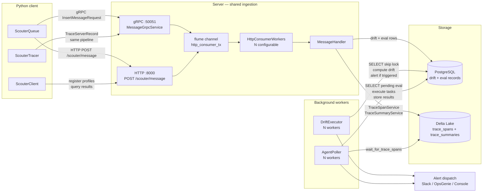
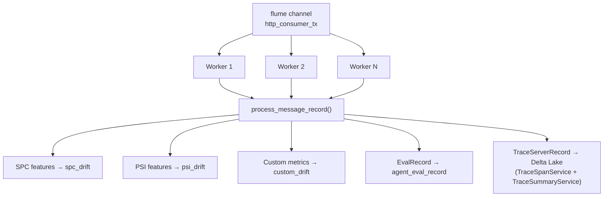
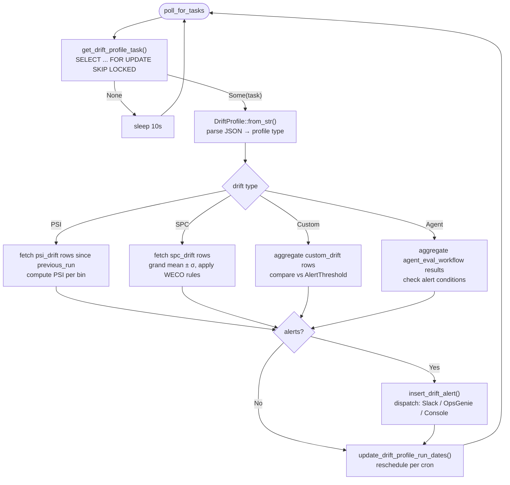
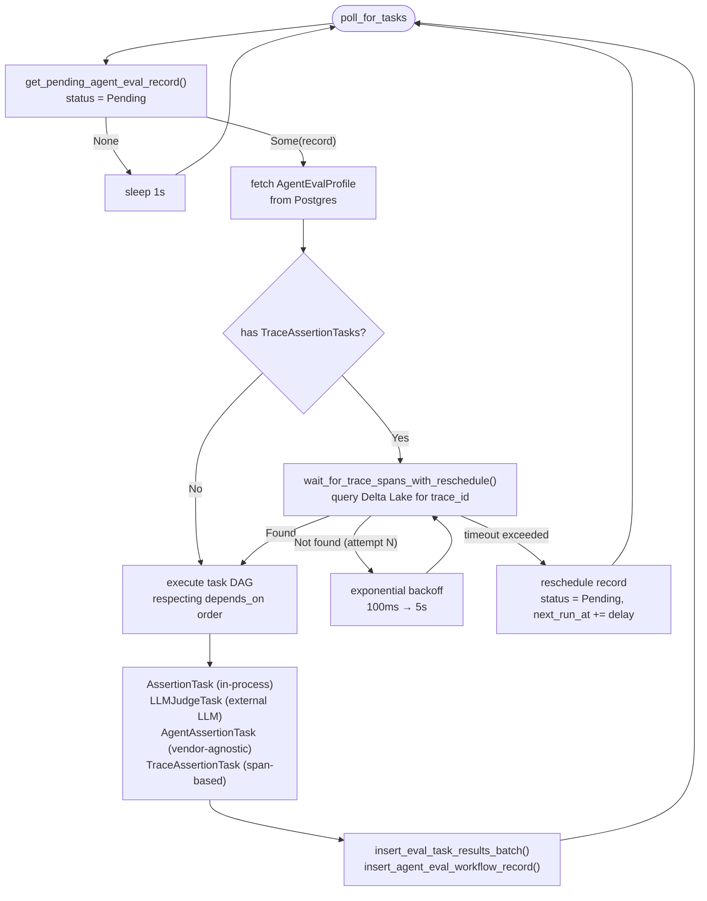
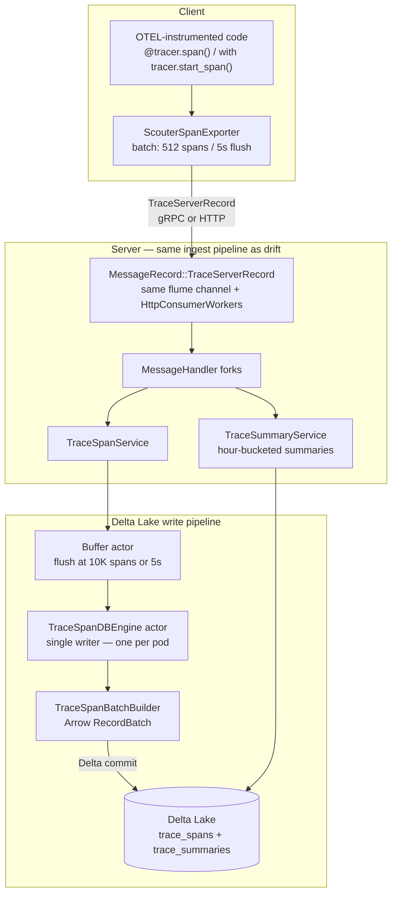
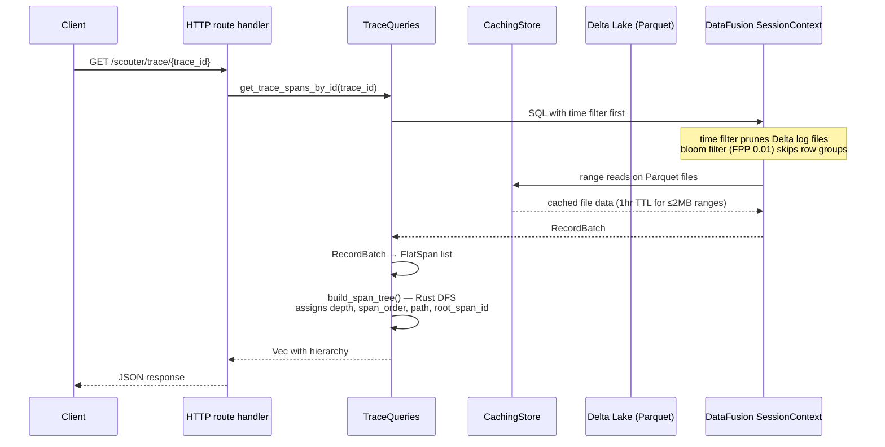
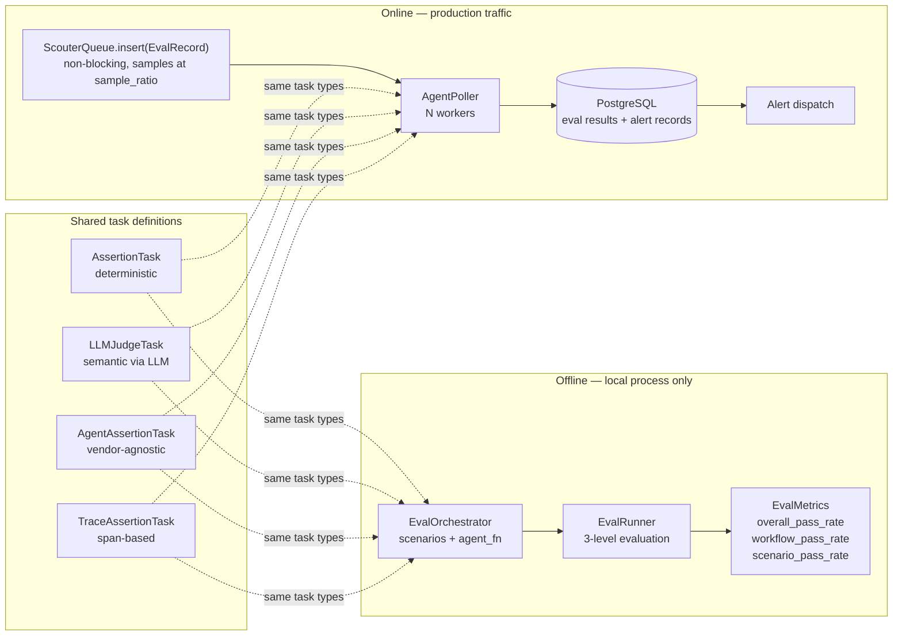

# Scouter architecture

Scouter is a dual-protocol Rust server — Axum HTTP on `:8000`, Tonic gRPC on `:50051` — backed by PostgreSQL for recent drift and evaluation data, and Delta Lake for long-term trace storage. Three subsystems (model monitoring, distributed tracing, and agentic evaluation) share a single ingestion pipeline. Records enter through the same channel, get routed in a single consumer layer, and diverge to storage at the `MessageHandler` fork point. Background workers then consume from storage on independent schedules.

---

## System overview



The important thing this diagram shows: `ScouterTracer` does not have a dedicated ingest path. A `TraceServerRecord` enters the same `flume::Sender<MessageRecord>` as an `SpcRecord` or an `EvalRecord`. The `MessageHandler` is the only place the paths diverge. Under write pressure, trace ingest competes with drift record ingest for consumer worker bandwidth.

---

## AppState: shared server root

Every HTTP handler, gRPC handler, and background worker holds an `Arc<AppState>`. This is the complete field list:

| Field | Type | Purpose |
|---|---|---|
| `db_pool` | `Pool<Postgres>` | Shared across all handlers, polling workers, and message handlers |
| `auth_manager` | `AuthManager` | JWT verification on every authenticated request |
| `task_manager` | `TaskManager` | Coordinates all background workers; `watch::channel` broadcasts shutdown |
| `config` | `Arc<ScouterServerConfig>` | Typed env-var config, frozen at startup |
| `http_consumer_tx` | `Sender<MessageRecord>` | flume channel sender; both HTTP and gRPC handlers drop records here |
| `trace_service` | `Arc<TraceSpanService>` | Owns both Delta Lake actors; singleton for the lifetime of the server |
| `trace_summary_service` | `Arc<TraceSummaryService>` | Hour-bucketed summary table; feeds the paginated trace list |
| `dataset_manager` | `Arc<DatasetEngineManager>` | Bifrost offline dataset engine |
| `eval_scenario_service` | `Arc<EvalScenarioService>` | Offline eval scenario orchestration |

Shutdown order matters. `task_manager.shutdown()` must complete before `trace_service.signal_shutdown()`, which must complete before `db_pool.close()`. The implementation sequences these correctly, but anything that restructures shutdown must preserve this ordering or you lose in-flight span data.

---

## ScouterQueue: client-side ingestion

```mermaid
sequenceDiagram
    participant PY as Python app
    participant QB as QueueBus (PyO3)
    participant CH as tokio::mpsc channel
    participant EH as spawn_queue_event_handler
    participant QN as QueueNum (SPC/PSI/Custom/Agent)
    participant TR as Transport
    participant WK as HttpConsumerWorkers
    participant MH as MessageHandler
    participant PG as PostgreSQL

    PY->>QB: queue.insert(record)
    Note over QB: sub-µs; enqueues to unbounded channel
    QB->>CH: Event::Task(QueueItem)
    CH->>EH: recv_async()
    EH->>QN: route by record type
    QN->>QN: batch records
    Note over QN: PSI: also flushes every 30s via background ticker
    QN->>TR: MessageRecord (gRPC / HTTP / Kafka / RabbitMQ / Redis)
    TR->>WK: deliver record
    WK->>MH: process_message_record()
    MH->>PG: INSERT into spc_drift / psi_drift / custom_drift / agent_eval_record
    Note over QB,EH: On shutdown: CancellationToken fires<br/>queue.flush() drains in-flight records before task exits
```

A few things worth knowing about this path:

The GIL is released during `shutdown()` via `py.detach()`. This is intentional — the wait periods inside the shutdown sequence would deadlock other Python threads otherwise. It's not a leak.

Transport is selected once at `ScouterQueue::from_path()` or `from_profile()` and is fixed for the queue's lifetime. You cannot switch from HTTP to Kafka on a live queue.

PSI has a 30-second background flush ticker independent of batch capacity. SPC does not — it flushes only when the batch fills. Low-traffic SPC services can accumulate records in memory longer than you'd expect.

Queue insert errors are logged but not returned to the caller. The `ScouterQueue` is deliberately lossy from the application's perspective — monitoring infrastructure should not affect application latency or error paths.

---

## Server-side message consumption



`MessageRecord` is an enum. The variant determines where the record goes. `TraceServerRecord` is the only type that routes to Delta Lake; everything else goes to PostgreSQL. The worker count is configurable at startup (`HTTP_CONSUMER_WORKERS`, defaults to 4).

There is no separate ingest service for traces. The same `HttpConsumerWorker` that handles drift records handles spans. If you're sizing worker pools, account for trace volume alongside drift and eval volume.

---

## Drift detection: DriftExecutor

N workers start at server boot, staggered 200ms apart to avoid a thundering herd on a cold start. Each worker runs the same poll loop independently:



| Drift type | Algorithm | Default thresholds |
|---|---|---|
| PSI | Σ(y_i − y_b) × ln(y_i / y_b) per bin | <0.1 stable / 0.1–0.25 moderate / >0.25 significant |
| SPC | Grand mean ± σ from baseline; WECO rules (8 16 4 8 2 4 1 1) | 3σ zone violations |
| Custom | Aggregated metric vs. `AlertThreshold` | Below / Above / Outside (user-defined) |

`SELECT ... FOR UPDATE SKIP LOCKED` is what makes N concurrent workers safe without a separate job queue. A task locked by one worker is invisible to others until the lock is released.

`update_drift_profile_run_dates()` is called unconditionally — even if drift computation fails. A stuck task won't monopolize the lock forever. The tradeoff is that a failed run still advances the schedule, so you might miss one drift window on a transient error.

Drift computation reads from PostgreSQL only. Delta Lake is trace-only.

---

## Agent evaluation: AgentPoller

N workers, same structure as drift workers. Agent eval is more complex because it may need to wait for trace spans to arrive before it can execute `TraceAssertionTask` entries.



The trace wait exists because `EvalRecord`s often arrive before their associated OTEL spans — the eval record hits PostgreSQL fast, but spans go through Delta Lake writes with a 5-second flush interval. At default settings (`GENAI_TRACE_WAIT_TIMEOUT_SECS=10`, `GENAI_TRACE_BACKOFF_MILLIS=100`, `GENAI_TRACE_RESCHEDULE_DELAY_SECS=30`), worst-case latency from eval record insertion to stored result is around 90 seconds. Tune these based on your span arrival p95 in production.

Task execution follows the declared `depends_on` DAG. Each task sees base context plus explicitly declared dependency outputs — not the full context of every upstream task. This is intentional scoping.

`AgentContextBuilder` detects vendor format automatically: `choices` key → OpenAI, `stop_reason` + `content` → Anthropic, `candidates` → Gemini/Vertex. The `response` sub-key wrapper is supported for all vendors.

`condition=True` on an `AssertionTask` makes it a gate: failure skips all downstream tasks that declare a `depends_on` dependency on it. Use this to avoid LLM judge calls when cheap structural preconditions fail.

**A naming note:** `AgentDrifter` inside `DriftExecutor` and `AgentPoller` are separate workers with separate concerns. `AgentDrifter` aggregates stored eval workflow results and checks alert conditions on a cron schedule. `AgentPoller` runs the actual task evaluation. They don't share code or state. The name overlap is confusing — keep it in mind when reading the codebase.

---

## Distributed tracing: ingest to query

### Write path



For full schema, compaction schedule, bloom filter configuration, and multi-pod deployment details, see [Trace Storage Architecture](../tracing/storage-architecture.md).

Two callouts that aren't in the storage doc:

Span hierarchy fields — `depth`, `span_order`, `path`, `root_span_id` — are not stored. They're computed at query time via a Rust DFS traversal in `build_span_tree()`. This matches how Jaeger and Zipkin handle it, and avoids ingest ordering dependencies. The implication is that tree assembly is work at read time, not write time.

`search_blob` is pre-computed at ingest by concatenating service name, span name, and flattened attributes into a single string. Attribute filter queries use `search_blob LIKE '%key:value%'`. No JSON parsing at query time.

### Query path



The query planner evaluates the time range filter before the bloom filter on `trace_id`. With `reorder_filters=true` in the DataFusion session config, the bloom filter (FPP 0.01) skips ~99% of row groups for single-trace lookups. Time-bounded range queries benefit more from the partition pruning on `partition_date`.

---

## Offline vs. online evaluation



Task definitions — `AssertionTask`, `LLMJudgeTask`, `AgentAssertionTask`, `TraceAssertionTask` — are identical between offline and online. Write them once, validate in CI, run them against production traffic.

Offline evaluation uses `MockConfig()` transport. Records never leave the process. `EvalRunner` automatically pulls spans from the global trace capture buffer — no manual wiring needed between `EvalRecord` insertion and `TraceAssertionTask` evaluation.

Online sampling happens at `QueueNum::insert_agent_record()` before the transport layer. Records that don't pass the `sample_ratio` check are silently dropped, not transmitted. There's no counter or log entry for dropped records by design — sampling is a rate control mechanism, not an error path.

`EvalRunner.evaluate()` calls `block_on` internally and cannot be called from an async context. This is a hard constraint, not a known issue.

The offline evaluation engine runs 3-level aggregation:

1. **Sub-agent / workflow** — Per alias: flatten all records across scenarios into a single `EvalDataset`, evaluate against profile tasks, compute pass rate.
2. **Scenario** — Per scenario: evaluate scenario-level tasks, compute whether all tasks passed.
3. **Aggregate** — `EvalMetrics`: `overall_pass_rate`, `workflow_pass_rate`, `dataset_pass_rates` (per-alias dict), `scenario_pass_rate`, `total_scenarios`.

---

## Shutdown sequence

When the server receives SIGTERM, `AppState::shutdown()` runs these steps in order:

1. `task_manager.shutdown()` — fires the `watch::channel`; all drift workers and agent pollers exit their `tokio::select!` loop
2. `shutdown_trace_cache(&db_pool)` — flushes any pending trace cache entries to Postgres
3. `trace_service.signal_shutdown()` — buffer actor drains remaining spans; engine actor processes the final Delta commit
4. `trace_summary_service.signal_shutdown()` — same pattern for the summary table
5. `dataset_manager.shutdown()` — Bifrost engine shutdown
6. `eval_scenario_service.signal_shutdown()` — offline eval engine
7. `db_pool.close()` — all connections drained

Step 7 must come last. The trace cache flush at step 2 still needs a live pool. If you restructure this sequence, test under load before deploying.

---

## Trade-offs and known constraints

**Single Delta Lake writer per pod.** `TraceSpanDBEngine` is a single-writer actor. Multi-pod deployments designate one pod as the writer; reader pods call `update_incremental()` and never write. Running two writer pods against the same bucket path causes Delta log conflicts. The compaction control table prevents double-compaction but does not prevent double-writing of spans.

**Trace hierarchy is query-time computed.** `build_span_tree()` is an in-memory Rust DFS on every trace fetch. It's fast and bounded, but it's not free. Deep traces (hundreds of spans) will be noticeably slower to assemble than shallow ones. There is no stored index on parent-child relationships.

**`SKIP LOCKED` is not a durable job queue.** Drift profile tasks live in Postgres. The window between `SELECT ... SKIP LOCKED` and `update_drift_profile_run_dates()` is not transactional. If a drift worker crashes mid-computation, the task will be picked up again on the next tick — but double-computation is possible if the crash happens at exactly the right moment.

**Trace wait adds latency to agent eval.** At default config, worst-case lag from `EvalRecord` insertion to stored eval result is ~90 seconds (10s timeout × 3 retries + reschedule delays). Tune `GENAI_TRACE_WAIT_TIMEOUT_SECS`, `GENAI_TRACE_BACKOFF_MILLIS`, and `GENAI_TRACE_RESCHEDULE_DELAY_SECS` based on your span arrival p95. If your agents don't use `TraceAssertionTask`, this entire path is skipped.

**Queue errors are logged, not returned.** The `QueueBus` insert path intentionally swallows errors. In production, monitor server logs for `Error inserting entity into queue` — there's no counter exported by default.

**PSI flushes every 30s; SPC does not.** Low-traffic SPC services may accumulate records in memory for longer than expected. If you need tighter write latency for SPC, reduce the batch size or add a custom flush trigger.
