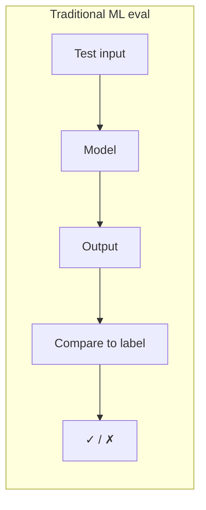
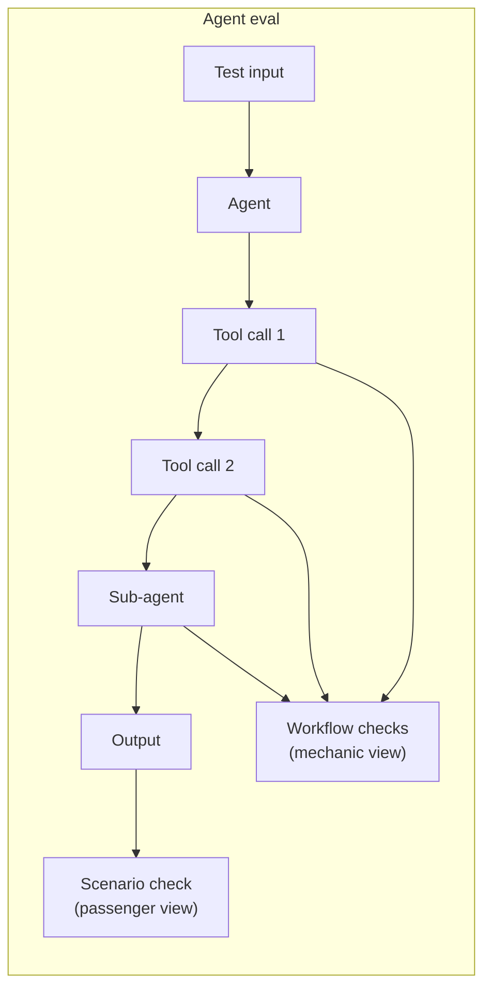

# The agent evaluation problem

Traditional ML evaluation is a solved workflow. You have a labeled test set, you compute accuracy or F1 or AUC, you compare the number to a threshold, and you ship or you don't. The inputs are fixed, the outputs are deterministic, and the metric tells you everything you need to know.

Agents break this model in ways that matter.

> For usage guide and quick start, see [Agent evaluation](../agents/overview.md).

---

## Agents aren't models

A classifier takes an input and returns a label. You can test it the same way every time and get the same answer. An agent takes an input, decides which tools to call, calls them in some order, accumulates context across steps, and eventually produces an output that depends on all of those intermediate decisions. The same prompt can produce different tool call sequences across runs. "It worked when I tested it" is the agent equivalent of "works on my machine."

Several things make this harder than it looks:

**Stochastic outputs.** Two runs of the same agent with the same input can take different paths. The final answer might be the same, but the tool calls, token counts, and intermediate reasoning differ. Traditional test assertions that check exact outputs will flake.

**Multi-step reasoning.** A correct final answer can mask broken intermediate steps. The retriever returned irrelevant documents but the LLM guessed right anyway. The classifier picked the correct category by accident. A sub-agent burned 10x more tokens than it should have. If you only check the end result, you won't see these problems until they compound into a visible failure.

**Tool orchestration.** Agent behavior is shaped by tool availability, context window limits, and orchestration logic that changes independently of the model. A tool API update, a context window reduction, or a prompt template change can silently alter behavior without touching the model weights.

**Session state.** Multi-turn agents accumulate context. The quality of turn 5 depends on turns 1 through 4. You can't evaluate a single turn in isolation and draw conclusions about the conversation.

**External dependencies.** Model provider updates, API changes, rate limit adjustments — any of these can degrade quality without a single line of your code changing. You need to detect this in production, not just in pre-deployment tests.

Think of it like a car. A passenger cares about one thing: did I get from A to B? A mechanic cares about what happened under the hood. The car arriving home doesn't mean the engine is healthy. It might have gotten there with a misfiring cylinder, low oil pressure, and a transmission that's about to fail. Agent evaluation needs both views — the passenger's and the mechanic's.

The traditional pipeline has one evaluation point. The agent pipeline has many, and skipping the intermediate ones means you're flying blind on component health.

---

## Scope of the evaluation problem

Agent evaluation isn't one problem. It's several, and they overlap in ways that make "just add some assertions" insufficient.

**Single-agent evaluation.** One agent, one task, one set of quality criteria. This is the simplest case, and it maps reasonably well to traditional eval — but it's not enough for pipelines.

**Multi-agent pipeline evaluation.** A retriever feeds a synthesizer which feeds a validator. Each sub-agent has different quality requirements. A passing end-to-end result doesn't mean each component is healthy. You need per-component signals, and you need them from the same evaluation run.

**Prompt-level evaluation.** Did this specific prompt produce the right output? You're checking template variable substitution, context extraction, deterministic format constraints. Assertions work well here.

**Session-level evaluation.** Multi-turn conversations where quality depends on the full exchange. You need simulated user personas, termination signals, and evaluation of the conversation arc — not just individual turns.

**Scenario vs. workflow evaluation.** This is the passenger-vs-mechanic split, and it's worth being explicit about:

- *Scenario evaluation* treats the agent as a black box. Given this input, did it produce the right output? This is your end-to-end quality signal.
- *Workflow evaluation* opens the hood. Per-component health signals from structured records emitted during execution. Each sub-agent gets its own pass rate.

Both should run in a single pass. A passing scenario with failing workflow tasks means you got lucky — not that your agent is healthy.

| Dimension | What varies | Why it matters |
|---|---|---|
| Single vs. multi-agent | Number of components with independent quality requirements | A pipeline can pass end-to-end while individual components degrade |
| Prompt vs. session | Evaluation scope (one turn vs. full conversation) | Session quality depends on accumulated context, not isolated responses |
| Scenario vs. workflow | Black-box output vs. per-component internals | You need both to distinguish "correct answer" from "healthy system" |
| Offline vs. online | When evaluation runs (pre-deploy vs. production) | Different failure modes surface in each — curated tests miss distribution shift, production sampling misses edge cases in your test set |

---

## What a production evaluation system needs

If you're evaluating agents in a notebook and eyeballing results, that works for prototyping. It doesn't work when you have agents in production serving real traffic. Here's what the gap looks like:

**Offline evaluation.** Gate releases. Catch regressions. Establish quality baselines you can compare future runs against. Run a fixed set of test scenarios before deployment, diff pass rates, and block CI if quality drops.

**Online evaluation.** Sample production traffic, evaluate asynchronously, and catch the things that don't show up in curated test scenarios: distribution shift, real-world edge cases, gradual quality degradation after a model provider update you didn't know about. This has to happen without affecting application latency.

**Unified task definitions.** Write evaluation tasks once, use them in both offline and online modes. Your offline quality bar and your production quality bar should be the same bar. If they diverge, you're maintaining two evaluation systems and hoping they agree.

**Eval registries and profiles.** Versioned evaluation configurations tied to service identity — not ad-hoc scripts in a notebook. When a profile changes, you know what changed, who changed it, and what version of evaluation is running against what version of the agent.

**Regression tracking.** Save baseline results from a known-good run. Diff against new runs. Flag regressions above configurable thresholds. Gate CI/CD on eval pass rates. Without this, you're comparing against vibes.

**Alerting.** Evaluations without alerts are dashboards nobody looks at. Scheduled checks on a cron, dispatched to Slack, OpsGenie, or console. When pass rates drop below your baseline, you want to know within the hour — not when a customer reports it.

**Trace-aware evaluation.** You can't evaluate agent behavior you can't observe. Tracing is not optional for agents — it's the only way to know *how* the agent arrived at an answer, not just *what* it returned. And trace data should feed directly into the evaluation pipeline, not sit in a separate observability silo.

**Multi-vendor support.** Agents use different LLM providers. Evaluation shouldn't lock you into one vendor for the judge, and it should understand response formats from OpenAI, Anthropic, Google, and others without manual format wrangling.

**Performance.** Evaluation infrastructure must not affect application latency. Sub-microsecond queue insertion. Async server-side processing. If your monitoring slows down the thing it's monitoring, you've created a new problem.

---

## Where existing tools fall short

Most platforms do one half well. MLflow and Google ADK have solid offline evaluation — run a batch, compute metrics, compare results. Datadog has strong online observability with per-span scoring. LangSmith and Langfuse sit somewhere in between. But none of them share task definitions between offline and online modes. You end up writing evaluation logic twice: once for your CI pipeline, once for production monitoring. When the two definitions drift apart — and they will — you lose confidence that pre-deployment tests reflect production behavior.

Trace-based evaluation is treated as a separate concern everywhere else. You can view traces in one tool and run evaluations in another, but asserting on span properties (execution order, retry counts, token budgets per span) as part of the same evaluation pipeline that checks output quality? That requires bridging two systems manually.

Agent-specific assertions — "was this tool called with these arguments," "did the tools execute in this order," "what model produced this response" — are either missing or vendor-locked. Most platforms parse one vendor's format natively and leave you to normalize the rest yourself.

And then there's pricing. SaaS platforms like Datadog and LangSmith add per-span or per-trace costs that scale linearly with traffic. Self-hosted options like Langfuse and MLflow avoid that, but they lack the evaluation orchestration or online monitoring pieces — you get storage and visualization, not a complete eval system.

For a detailed feature-by-feature comparison, see [Platform comparison](./comparison.md).

---

## What Scouter provides

Scouter is a self-hosted evaluation platform built to close the gaps above. The server is Rust, the client is Python, and evaluation runs the same way whether you're gating a release or monitoring production traffic.

Here's what it covers:

**Four task types** that span the full evaluation surface. `AssertionTask` for deterministic rule-based checks (format, thresholds, patterns). `LLMJudgeTask` for semantic evaluation via any LLM provider. `TraceAssertionTask` for assertions on OpenTelemetry span properties. `AgentAssertionTask` for vendor-agnostic tool call and response structure verification — auto-detects OpenAI, Anthropic, and Google formats from the response JSON. All four work in both offline and online modes without modification.

**46 comparison operators.** Not a toy assertion library. Numeric comparisons, string matching, regex, collection operations, type validation, format checks (email, URL, UUID, ISO 8601, JSON), range checks, length constraints, and approximate equality. Enough to express real-world validation rules without reaching for custom code.

**Dependency DAGs and conditional gates.** Tasks can depend on upstream results, and any task can act as a gate — if a cheap format check fails, the expensive LLM judge never runs. The engine topologically sorts the DAG and executes independent tasks in parallel.

**Freeform context with path extraction.** `EvalRecord` takes a freeform dict. Put whatever you want in it — model outputs, metadata, ground truth labels, intermediate results. Tasks read from it via `context_path` (dot-notation into nested fields) and template variable substitution (`${field.path}`). No fixed schema to conform to.

**Offline evaluation with scenarios.** `EvalOrchestrator` runs your agent against test scenarios (single-turn, multi-turn, or interactive), collects records, evaluates tasks at three levels (sub-agent, scenario, aggregate), and produces pass rates you can diff against a baseline. Regression comparison flags degraded aliases above configurable thresholds.

**Online evaluation with zero application impact.** Non-blocking queue insertion (sub-microsecond), server-side async evaluation via `AgentPoller` workers, configurable sampling via `sample_ratio`, and scheduled alert dispatch (Slack, OpsGenie, Console) on a cron. Records flow through gRPC or HTTP to PostgreSQL; the poller picks them up independently.

**Trace storage on Delta Lake.** Spans land in a columnar store queried via DataFusion. Bloom filters on trace_id, time-partitioned, auto-compacted. `TraceEvalPoller` creates synthetic `EvalRecord`s from traces, bridging the observability and evaluation pipelines.

**Profile versioning and registration.** Profiles are identified by a `(space, name, version)` triple. Register once at deployment, and the server knows which evaluation to run against which agent version.

**Multi-agent evaluation.** One profile per sub-agent in your pipeline. Each gets its own task set, its own results, and its own pass rate. A pipeline-level aggregate tells you the overall health; per-alias breakdowns tell you where to look when something degrades.

The rest of this document covers how each of these pieces works:

- [Building blocks: eval profiles and task types](./eval-profiles-and-tasks.md)
- [Offline evaluation architecture](./offline-evaluation.md)
- [Online evaluation architecture](./online-evaluation.md)
- [Observability engine and trace-based evaluation](./observability-and-traces.md)
- [Trade-offs and operational considerations](./discussion-and-tradeoffs.md)
