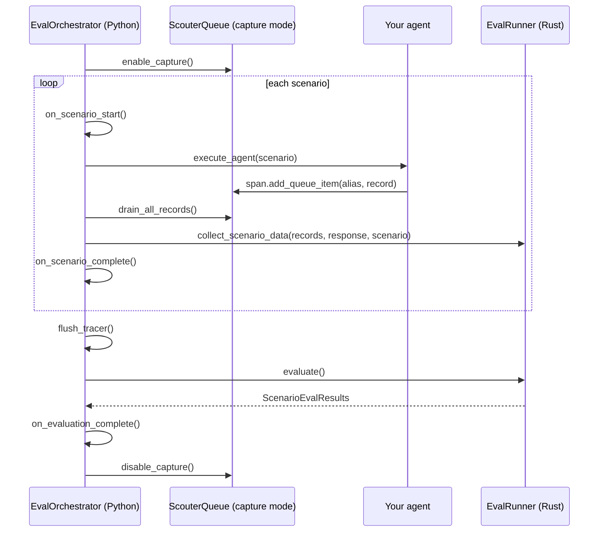
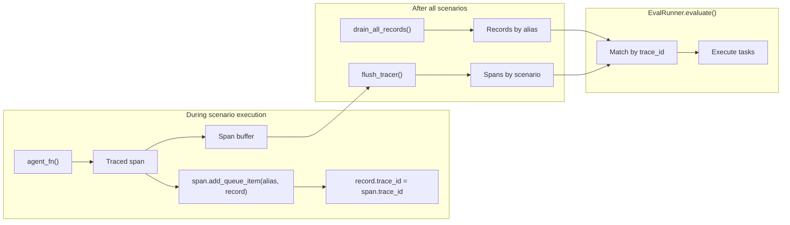
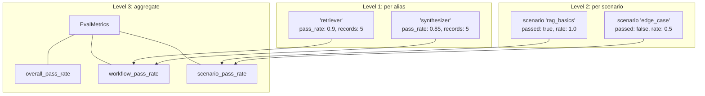

# Offline evaluation architecture

Offline evaluation gates releases. You run your agent against a suite of test scenarios before deployment, compute pass rates, and compare them to a known-good baseline. If quality drops, the merge is blocked.

Scouter splits this into two layers: a Python orchestrator that handles the messy parts (calling your agent, managing sessions, simulating users) and a Rust evaluation engine that handles the compute (parallel task execution, comparison operators, trace matching). The orchestrator collects data; the engine evaluates it.

For the complete usage guide with code examples, see [Offline evaluation](../agents/offline-evaluation.md).

> For how these building blocks (task types, DAGs, operators) work, see [Building blocks](./eval-profiles-and-tasks.md).

---

## Two layers: orchestration and evaluation

`EvalOrchestrator` is a Python class. It manages the scenario execution lifecycle: enabling capture, running your agent function, draining records, collecting trace spans, and calling lifecycle hooks. You pass it a `ScouterQueue` (with registered profiles), an `EvalScenarios` collection, and an agent function.

`EvalRunner` is the Rust engine underneath (via PyO3). It receives the collected data and executes the full task DAG, computes pass rates, and returns structured results. Stateless: data in, results out.

Why the split? Python is the right language for calling your agent (which is probably Python), managing async sessions, and simulating user personas. Rust is the right language for evaluating thousands of assertion tasks in nanoseconds with parallel execution. Each layer does what it's good at.

During offline evaluation, records never leave the process. The queue uses `MockConfig` transport internally, so `EvalRecord` objects accumulate in memory. No server connection required.

The orchestrator is subclassable. Override `execute_agent()` to customize how your agent is called. Override `on_scenario_start()` and `on_scenario_complete()` for setup/teardown. Override `build_scenario_response()` to transform agent output before scenario-level evaluation. All hooks are no-ops by default.

---

## Scenario types

Three execution modes, selected automatically based on which fields you set on `EvalScenario`.

| Mode | Trigger | Turns | Record collection | Use case |
|---|---|---|---|---|
| Single-turn | Only `initial_query` set | 1 | After the single call | One-shot tasks: classification, extraction, summarization |
| Multi-turn | `predefined_turns` is non-empty | 1 + len(turns) | After all turns complete | Scripted conversations where you know the follow-up queries |
| Interactive | `simulated_user_persona` is set | Up to `max_turns` (default 10) | After loop ends | Session-stateful agents where quality depends on the full exchange |

### Single-turn

The simplest case. `initial_query` goes to your agent function, the response comes back, records get drained. One call, one response, evaluate.

### Multi-turn (predefined)

You provide a list of follow-up queries in `predefined_turns`. The orchestrator calls your agent function once for `initial_query`, then once per turn in order. The last response is used for scenario-level evaluation.

Your agent function receives each query in isolation. The orchestrator does not manage conversation history for you. If your agent needs history, it should maintain its own session state. For full control, subclass `EvalOrchestrator` and override `execute_agent()`.

### Interactive (simulated user)

The agent runs in a loop with a simulated user. Each iteration: the agent responds, the simulated user decides the next message based on the original intent, the agent's response, and the full conversation history.

The loop terminates when the simulated user's response contains `termination_signal`, or when `max_turns` is reached. Whichever comes first.

Two ways to provide the simulated user: pass a `simulated_user_fn` callable to the constructor, or subclass and override `execute_simulated_user_turn()`. The callable receives `(initial_query, agent_response, history)` where history is a list of `{"user": str, "agent": Any}` dicts from prior exchanges.

Records are drained once at the end of the loop, not per-turn. All `EvalRecord` objects across the full conversation are evaluated together as a single dataset. This is intentional: you want to evaluate the conversation as a whole, not each turn in isolation.

---

## Record collection and trace correlation

During scenario execution, your agent emits `EvalRecord` objects through the queue. Inside a traced span, you call `span.add_queue_item(alias, record)`, and the record is automatically stamped with the active span's `trace_id`. This stamp connects records to trace spans for `TraceAssertionTask` evaluation later.

The queue is in capture mode, so records accumulate in an in-memory buffer. After each scenario completes, the orchestrator calls `drain_all_records()`, which returns a dict of `alias` to `List[EvalRecord]`. These records, along with the agent's response, are passed to the Rust engine via `collect_scenario_data()`.

Trace spans follow a similar path. The orchestrator enables a local span capture buffer at the start of `run()`. Spans accumulate there during scenario execution. After all scenarios complete, `flush_tracer()` ensures every span has landed in the buffer before evaluation begins.

The Rust engine matches records to spans by `trace_id` during evaluation. It also handles a subtlety: spans that have entity UIDs but no queue record marker. These represent traced work (tool calls, LLM calls) that happened within a sub-agent's scope but didn't produce an explicit `EvalRecord`. The engine synthesizes `EvalRecord` objects for these spans so that `TraceAssertionTask` evaluation can still run against them.

---

## Three-level evaluation

Evaluation runs at three levels, and each answers a different question.

### Level 1: sub-agent evaluation (the mechanic's view)

For each alias (sub-agent profile), the engine flattens all records from all scenarios into a single `EvalDataset`. It evaluates the profile's tasks against this combined dataset and computes a pass rate.

This gives you a holistic quality signal per sub-agent, independent of which scenario produced each record. If your retriever is degrading, you'll see it here even if individual scenarios still pass end-to-end.

Example: alias `"retriever"` produced 5 records across 5 scenarios. All 5 are combined, evaluated against the retriever's profile tasks, and produce a single pass rate of 0.9.

### Level 2: scenario evaluation (the passenger's view)

For each scenario that has tasks defined, the engine builds an `EvalRecord` from the scenario context (the agent's final response, `expected_outcome`, and metadata). It evaluates the scenario's tasks against this record.

This is the black-box check. Did the agent produce the right end-to-end result for this test case? If the scenario has `TraceAssertionTask` instances, the engine resolves them by matching `trace_id` values from the scenario's records to captured spans.

### Level 3: aggregate metrics

Computed from Level 1 and Level 2 outputs:

| Metric | What it measures |
|---|---|
| `dataset_pass_rates` | Per-alias pass rate (from Level 1). `{"retriever": 0.9, "synthesizer": 0.85}` |
| `scenario_pass_rate` | Fraction of scenarios where all tasks passed (from Level 2) |
| `workflow_pass_rate` | Average of all alias pass rates |
| `overall_pass_rate` | Average of workflow and scenario pass rates |
| `total_scenarios` / `passed_scenarios` | Counts |
| `scenario_task_pass_rates` | Per-scenario, per-task pass rate breakdown |

A passing scenario with a failing sub-agent means you got lucky. A healthy sub-agent with failing scenarios means something went wrong in composition. You need both levels to distinguish "correct answer" from "healthy system."

---

## Regression comparison

Save results from a known-good run as a baseline. Compare new runs against it. Gate CI on the comparison.

The workflow:

1. Merge to main. Offline eval runs against your scenario suite. Results saved as a baseline artifact.
2. PR opens. Offline eval runs against the same suite.
3. Compare PR results to baseline with a configurable `regression_threshold` (default 0.05, meaning a 5% pass-rate drop counts as a regression).
4. If any alias regresses beyond the threshold, block the merge.
5. On merge, save the new baseline.

`ScenarioEvalResults.compare_to(baseline, regression_threshold)` returns a `ScenarioComparisonResults` with everything you need for CI gating:

- `regressed`: boolean. True if any alias dropped below the threshold. This is your CI gate signal.
- `regressed_aliases` / `improved_aliases`: which sub-agents changed and in which direction.
- `scenario_deltas`: per-scenario comparison showing `baseline_pass_rate` vs `comparison_pass_rate` and whether `status_changed`.
- `new_aliases` / `removed_aliases`: structural changes (added or removed sub-agents).
- `new_scenarios` / `removed_scenarios`: structural changes in the scenario suite.

Both `ScenarioEvalResults` and `ScenarioComparisonResults` serialize to JSON via `save(path)` and `load(path)`. Results round-trip cleanly; internal state (spans, datasets) is excluded from serialization.

---

## EvalDataset: the lightweight path

When you already have records (from a previous run, a production log export, or a separate data pipeline) and don't need a live agent, skip the orchestrator entirely.

`EvalDataset` takes records and tasks directly. Call `evaluate()` and get `EvalResults`. Same Rust evaluation engine, same task DAG, same comparison operators. No orchestration overhead, no scenario lifecycle, no capture management.

Use for: re-evaluating historical data with updated task definitions, evaluating exported production records offline, quick iteration on tasks without running your agent.

For details, see [EvalDataset](../agents/eval-dataset.md).
