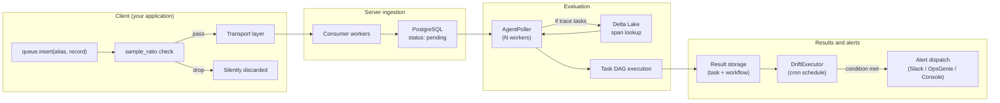

# Online evaluation architecture

Online evaluation monitors agents in production. You sample live traffic, evaluate it asynchronously on the server, and fire alerts when quality degrades. The application never blocks on evaluation; the monitoring infrastructure is invisible to your users.

This page walks through the full data path, from client-side queue insertion to alert dispatch. For setup and configuration, see [Online evaluation](../agents/online-evaluation.md).

> For system-wide ingestion pipeline details, see [Architecture](../architecture/overview.md).

---

## The production data path

An `EvalRecord` travels through ten steps between your application and an alert in Slack. Here's the full lifecycle:

Step by step:

1. Your application calls `queue.insert(alias, record)`. The record enters a lock-free `ArrayQueue` (crossbeam). Sub-microsecond. Non-blocking. The GIL is released during insertion.

2. `sample_ratio` is checked before the record reaches the transport layer. If the profile's ratio is 0.1, roughly 10% of records proceed. The rest are silently dropped, not transmitted, not counted. Sampling is rate control, not an error path.

3. The transport layer serializes and sends the record. HTTP, gRPC, Kafka, RabbitMQ, or Redis, selected once at queue creation. See [Event bus transports](#event-bus-transports) below.

4. On the server, the message router dispatches records to dedicated flume channels by type. Eval records and drift profiles go to the server records channel (bounded at 1000, `SERVER_RECORD_CONSUMER_WORKERS` workers). Trace spans go to a separate trace channel (bounded at 500, `TRACE_CONSUMER_WORKERS` workers). Tags go to a third channel (bounded at 200). Each channel has its own worker pool, so traffic in one type doesn't starve the others.

5. Server record workers process the `EvalRecord` and insert it into PostgreSQL's `agent_eval_record` table with `status=pending`.

6. `AgentPoller` workers continuously poll for pending records using `SELECT ... FOR UPDATE SKIP LOCKED`. A record locked by one worker is invisible to others. No external job queue needed.

7. If the profile has `TraceAssertionTask` instances, the poller queries Delta Lake for spans matching the record's `trace_id`. Spans often arrive after eval records (Delta Lake has a 5-second flush interval), so the poller uses exponential backoff: 100ms, 200ms, 400ms, up to a 5-second cap. If spans still aren't available after the timeout, the record is rescheduled with a 30-second delay and retried later.

8. The task DAG executes. Same engine as offline evaluation: topological sort into stages, parallel execution within stages via Tokio `JoinSet`, sequential across stages.

9. Results are stored in PostgreSQL: per-task results in `agent_eval_task`, workflow-level aggregates (pass rate, duration, execution plan) in `agent_eval_workflow`. The eval record status is updated to `completed` or `failed`.

10. On a cron schedule, the `DriftExecutor` checks alert conditions. It aggregates workflow pass rates since the last check. If the pass rate drops below the configured baseline minus delta, it dispatches an alert.

---

## Queue architecture

The queue is the integration point for your application. Its design goal is simple: monitoring must not affect application latency.

`ScouterQueue` wraps a lock-free `ArrayQueue` with capacity 50 items. `insert()` pushes a record and returns immediately. No network call, no serialization, no blocking. Records batch up in the queue and publish to the configured transport when either 25 items accumulate or a 30-second timer fires, whichever comes first.

Error handling is deliberately lossy. If the queue is at capacity, the insert retries briefly (exponential backoff: 100ms, 200ms, 400ms) and then drops the record. Insert errors are logged but never returned to the caller. This is intentional: the alternative, returning errors to the caller, would make monitoring infrastructure a source of application failures. The queue is fire-and-forget.

If you need to track insert failures, monitor server logs for queue push errors. But in practice, if your queue is consistently full, the fix is to increase polling throughput on the server side (more workers or faster evaluation), not to add error handling on the client.

On shutdown, a `CancellationToken` fires and the queue flushes any in-flight records before the background task exits. The GIL is released during shutdown so Python's interpreter can finalize cleanly.

---

## AgentPoller: the evaluation worker

N workers start at server boot, staggered 200ms apart to avoid a thundering herd on cold start. Each worker runs independently in a loop: poll for a pending record, evaluate it, store results, repeat. When no work is available, the worker sleeps for 1 second before polling again.

The polling query uses PostgreSQL's `FOR UPDATE SKIP LOCKED`, which means a record locked by one worker is invisible to every other worker. This gives you work distribution across workers without an external job queue. Records are ordered by retry count (ascending) then scheduled time, so fresh records are preferred over retried ones.

### Trace wait logic

EvalRecords typically arrive before their associated OpenTelemetry spans. The eval record hits PostgreSQL fast; spans go through Delta Lake writes with a flush interval measured in seconds.

If a profile has `TraceAssertionTask` instances, the poller must wait for spans before evaluation can proceed:

1. Look up the record's `trace_id` (either explicit on the record, or resolved from Delta Lake's trace summary using the `queue_uid`).
2. Query Delta Lake for spans matching that `trace_id`.
3. If spans aren't there yet, back off exponentially: 100ms, 200ms, 400ms, doubling up to a 5-second cap per attempt.
4. If the total wait exceeds the timeout (default 10 seconds), reschedule the record. The record's status reverts to `pending` with `scheduled_at` pushed forward by the reschedule delay (default 30 seconds).
5. After `max_retries` (default 3) rescheduled attempts with no spans, the record is marked `failed`.

If your profiles don't use `TraceAssertionTask`, this entire wait path is skipped. Evaluation latency drops to whatever the task DAG takes to execute: nanoseconds for assertion-only profiles, seconds for profiles with `LLMJudgeTask`.

### Configuration

| Environment variable | Default | Effect |
|---|---|---|
| `GENAI_WORKER_COUNT` | 2 | Number of concurrent evaluation workers |
| `GENAI_MAX_RETRIES` | 3 | Max reschedule attempts per record |
| `GENAI_TRACE_WAIT_TIMEOUT_SECS` | 10 | How long each attempt waits for spans |
| `GENAI_TRACE_BACKOFF_MILLIS` | 100 | Initial backoff between span checks |
| `GENAI_TRACE_RESCHEDULE_DELAY_SECS` | 30 | How far forward to push `scheduled_at` on timeout |

At default settings, worst-case latency from eval record insertion to stored result is roughly 90 seconds: 10-second trace wait, times 3 retries with 30-second reschedule delays between them. Typical latency for profiles without trace assertions is under a second.

---

## Alert system

Evaluations without alerts are dashboards nobody looks at. The alert system turns pass-rate degradation into notifications.

An `AgentAlertConfig` on the profile specifies three things: a dispatch target (where to send alerts), a cron schedule (when to check), and an alert condition (what triggers it).

The alert condition has a `baseline_value` (your expected pass rate, e.g., 0.80 for 80%), an `alert_threshold` direction (Below, Above, or Outside), and an optional `delta` (tolerance). The check logic is straightforward:

- Below with delta 0.05: alert if observed pass rate < baseline - 0.05
- Above with delta 0.10: alert if observed pass rate > baseline + 0.10
- Outside with delta 0.05: alert if observed pass rate is more than 0.05 away from baseline in either direction
- Without delta: alert on any crossing of the baseline value

The `DriftExecutor` runs this check, not the `AgentPoller`. These are separate workers with separate concerns. The poller evaluates individual records. The drift executor aggregates results and checks alert conditions on the cron schedule. They share no code or state.

(The naming is confusing. The class that checks agent eval alerts inside the `DriftExecutor` is called `AgentDrifter`. This is a naming artifact from the drift monitoring system that the agent evaluation system grew out of. We know.)

Dispatch targets: `SlackDispatchConfig(channel)`, `OpsGenieDispatchConfig(team, api_key)`, or `ConsoleDispatchConfig()`. Schedule options: `CommonCrons` enum (EveryHour, Every6Hours, EveryDay, Every12Hours) or a custom cron expression.

---

## Same tasks, both modes

The task definitions, comparison operators, dependency DAGs, and conditional gates are identical between offline and online evaluation. The Rust evaluation engine is the same code path. A `TraceAssertionTask` that gates a release in CI runs the exact same comparison logic when monitoring production traffic.

A profile registered for online monitoring can be loaded locally for offline evaluation. An assertion that catches a regression in your test suite catches the same regression in production. No translation layer, no configuration mapping, no "offline version" vs "online version" of a task.

This is a deliberate design decision. Your offline quality bar and your production quality bar should be the same bar. If they diverge, you're maintaining two evaluation systems and hoping they agree.

---

## Event bus transports

The transport determines how records get from your application to the server. All transports funnel through the same `MessageHandler` on the server side; processing is identical regardless of how the record arrived.

| Transport | Protocol | Decouples client from server? | Ops complexity | Best for |
|---|---|---|---|---|
| HTTP | POST to server endpoint | No (direct) | Lowest | Getting started, small deployments |
| gRPC | Protobuf over HTTP/2 | No (direct) | Low | Production workloads, higher throughput |
| Kafka | Publish to topic | Yes | Higher (Kafka cluster) | High-volume, existing Kafka infrastructure |
| RabbitMQ | AMQP queue | Yes | Medium (RabbitMQ server) | Decoupled delivery, simpler than Kafka |
| Redis | Pub/sub | Yes | Low (Redis instance) | Lightweight decoupled option |

Kafka, RabbitMQ, and Redis transports are feature-gated in the Rust build. The server binary includes all features in CI and dev builds. For production, enable only what you need.

The decoupled transports (Kafka, RabbitMQ, Redis) buy you resilience: if the server is down for a deployment, records queue in the broker instead of failing. The direct transports (HTTP, gRPC) are simpler to operate but require the server to be available when records are sent. For most deployments, gRPC is the right default. Reach for Kafka or RabbitMQ only if you already run them or need guaranteed delivery during server maintenance windows.
