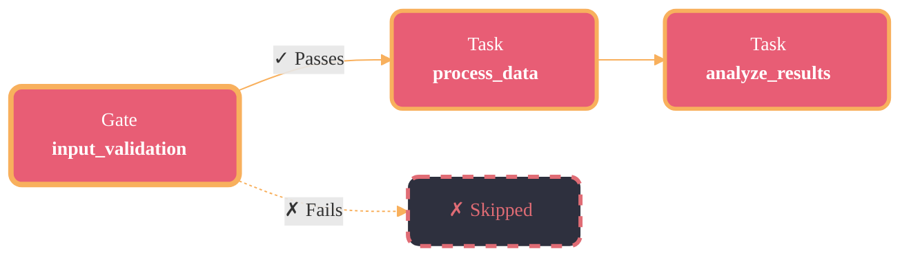

## Understanding Dependencies vs Conditional Gates

Scouter's evaluation framework supports two types of task relationships:

---

### Task Dependencies (Default Behavior)

Task dependencies allow downstream tasks to **consume results** from upstream tasks, regardless of whether the upstream task passed or failed. The downstream task executes as long as the dependency completes.

```mermaid
%%{init: {'theme':'scouter-dark', 'themeVariables': {'fontSize':'14px', 'fontFamily':'ui-monospace, monospace', 'primaryColor':'#272A34', 'primaryTextColor':'#000000', 'primaryBorderColor':'#e85d75', 'lineColor':'#f8b05d', 'secondBkgColor':'#e85d75', 'secondBorderColor':'#f8b05d', 'tertiaryColor':'#2E303E', 'tertiaryTextColor':'#ffffff', 'tertiaryBorderColor':'#f8b05d', 'nodeBkg':'#f16970', 'nodeBorder':'#f8b05d', 'clusterBkg':'#272A34', 'clusterBorder':'#f8b05d', 'tertiaryBkg':'#86aaf1', 'tertiaryBorder':'#f8b05d'}}}%%
flowchart LR
    A["LLM Judge<br/><b>empathy_assessment</b>"]
    B["Assertion<br/><b>empathy_score_threshold</b>"]
    C["✓ Task Result"]

    A -->|"Completes<br/>(pass or fail)"| B
    B -->|"Executes using<br/>upstream result"| C

    style A fill:#e85d75,stroke:#f8b05d,stroke-width:2px,color:#fff,rx:8px,ry:8px
    style B fill:#e85d75,stroke:#f8b05d,stroke-width:2px,color:#fff,rx:8px,ry:8px
    style C fill:#e85d75,stroke:#f8b05d,stroke-width:2px,color:#fff,rx:8px,ry:8px

```



**Example:**

```python
empathy_assessment = LLMJudgeTask(
    id="empathy_assessment",
    prompt=empathy_prompt,
    expected_value={"shows_empathy": True},
)

empathy_score_threshold = AssertionTask(
    id="empathy_score_threshold",
    field_path="empathy_assessment.score",
    operator=ComparisonOperator.GreaterThanOrEqual,
    expected_value=5,
    depends_on=["empathy_assessment"],
)
```

!!! success "Result"
    Even if `empathy_assessment` returns `shows_empathy: false`, the `empathy_score_threshold` task **still executes** and can access the score value.

---

### Conditional Gates (condition=True)

Conditional gates act as **control flow mechanisms**. Downstream tasks only execute if the gate **passes**. If the gate fails, all dependent tasks are skipped.



**Example:**

```python
input_validation = AssertionTask(
    id="input_validation",
    field_path="input.query",
    operator=ComparisonOperator.IsNotEmpty,
    expected_value=True,
    condition=True
)

process_query = LLMJudgeTask(
    id="process_query",
    prompt=query_prompt,
    expected_value={"valid": True},
    depends_on=["input_validation"],
)
```

!!! warning "Result"
    If `input_validation` **fails**, `process_query` is **skipped entirely**. No LLM call is made, and the task doesn't appear in results.

---

### Key Differences

| Aspect | Data Dependency | Conditional Gate |
|--------|----------------|------------------|
| **Flag** | `condition=False` (default) | `condition=True` |
| **Behavior** | Downstream task **always executes** after completion | Downstream task **only executes if gate passes** |
| **Use Case** | Pass results between tasks for processing | Control whether expensive operations run |
| **Result Storage** | Stored regardless of pass/fail | Only stored if task passes |
| **Comparison Impact** | Task appears in all workflow runs | Task may be missing from some runs |

---

### Practical Example: Multi-Stage Evaluation

```mermaid
%%{init: {'theme':'scouter-dark', 'themeVariables': {'fontSize':'13px', 'fontFamily':'ui-monospace, monospace', 'primaryColor':'#272A34', 'primaryTextColor':'#ffffff', 'primaryBorderColor':'#e85d75', 'lineColor':'#f8b05d', 'secondBkgColor':'#e85d75', 'secondBorderColor':'#f8b05d', 'tertiaryColor':'#2E303E', 'tertiaryTextColor':'#ffffff', 'tertiaryBorderColor':'#f8b05d', 'clusterBkg':'#272A34', 'clusterBorder':'#f8b05d'}}}%%
flowchart TB
    subgraph s1["Stage 1: Parallel Evaluation"]
        direction LR
        A["LLM<br/><b>empathy</b>"]
        B["Assertion<br/><b>acknowledges</b>"]
        C["LLM<br/><b>accuracy</b>"]
    end

    subgraph s2["Stage 2: Conditional Logic"]
        direction LR
        D["Assertion<br/><b>empathy_threshold</b><br/>condition=false"]
        E["Gate<br/><b>accuracy_gate</b><br/>condition=true"]
    end

    subgraph s3["Stage 3: Gated Operations"]
        F["LLM<br/><b>deep_analysis</b>"]
        G["✗ Skipped"]
    end

    A --> D
    C --> E
    E -->|"✓ Passes"| F
    E -.->|"✗ Fails"| G

    style s1 fill:#272A34,stroke:#f8b05d,stroke-width:2px,rx:12px,ry:12px
    style s2 fill:#272A34,stroke:#f8b05d,stroke-width:2px,rx:12px,ry:12px
    style s3 fill:#272A34,stroke:#f8b05d,stroke-width:2px,rx:12px,ry:12px

    style A fill:#e85d75,stroke:#f8b05d,stroke-width:3px,color:#fff,rx:8px,ry:8px
    style B fill:#e85d75,stroke:#f8b05d,stroke-width:3px,color:#fff,rx:8px,ry:8px
    style C fill:#e85d75,stroke:#f8b05d,stroke-width:3px,color:#fff,rx:8px,ry:8px
    style D fill:#e85d75,stroke:#f8b05d,stroke-width:3px,color:#fff,rx:8px,ry:8px
    style E fill:#e85d75,stroke:#f8b05d,stroke-width:4px,color:#fff,rx:8px,ry:8px
    style F fill:#e85d75,stroke:#f8b05d,stroke-width:3px,color:#fff,rx:8px,ry:8px
    style G fill:#2E303E,stroke:#E06C75,stroke-width:3px,stroke-dasharray:8,color:#E06C75,rx:8px,ry:8px
```



```python
empathy_assessment = LLMJudgeTask(
    id="empathy_assessment",
    prompt=empathy_prompt,
    expected_value={"shows_empathy": True},
)

technical_accuracy = LLMJudgeTask(
    id="technical_accuracy",
    prompt=accuracy_prompt,
    expected_value=True,
    ...
)

empathy_score_threshold = AssertionTask(
    id="empathy_score_threshold",
    field_path="empathy_assessment.score",
    operator=ComparisonOperator.GreaterThanOrEqual,
    expected_value=5,
    depends_on=["empathy_assessment"],
)

accuracy_gate = AssertionTask(
    id="accuracy_gate",
    field_path="technical_accuracy.is_accurate",
    operator=ComparisonOperator.Equals,
    expected_value=True,
    depends_on=["technical_accuracy"],
    condition=True
)

deep_analysis = LLMJudgeTask(
    id="deep_analysis",
    prompt=deep_analysis_prompt,
    expected_value=True,
    depends_on=["accuracy_gate"],
    ...
)
```

**Execution Flow:**

1. **Stage 1**: `empathy_assessment` and `technical_accuracy` run in parallel
2. **Stage 2**:
   - `empathy_score_threshold` **always runs** (uses empathy score regardless of pass/fail)
   - `accuracy_gate` evaluates the technical accuracy result
3. **Stage 3**:
   - If `accuracy_gate` **passes**: `deep_analysis` executes
   - If `accuracy_gate` **fails**: `deep_analysis` is **skipped** (saves LLM cost)

---

### Best Practices

!!! tip "Use Task Dependencies When"
    - You need to access upstream results for context
    - Every task should execute regardless of previous outcomes
    - You're building a task processing pipeline
    - You want consistent task counts across runs

!!! tip "Use Conditional Gates When"
    - You want to prevent expensive operations (LLM calls) if preconditions fail
    - You're implementing early-exit logic
    - You need to control execution flow based on business rules
    - Tasks should only run under specific conditions

!!! warning "Comparison Implications"
    Tasks with `condition=True` that fail won't appear in evaluation results. This can cause missing task warnings during comparison. Use conditional gates intentionally for control flow, not for result filtering.