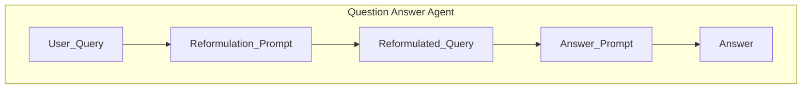

## GenAI Evaluation

In addition to real-time or online monitoring of GenAI services, Scouter provides you with tools to run offline GenAI evaluations. This is is often useful for when you (1) want to compare and benchmark various prompts, and (2) you want to evaluate different versions of prompts and GenAI services that you may already be using in production. Even more, we've desinged our offline evaluation system to have parity with our on-line evaluation/monitoring system, so that you can easily migrate your evaluation tasks to real-time monitoring when you are ready.

## Getting Started

To run and GenAI evaluation, you will first need to obtain your evaluation data and construct a list of `GenAIEvalRecord` instances. Each `GenAIEvalRecord` represents a single evaluation instance, containing the metadata you wish to evaluate. Note, we have left this intentionally flexible so that you can evaluate any type of metadata you wish.
Another way to think of `GenAIEvalRecord` is that it represents a single "call" to your GenAI service that you wish to evaluate (inputs, outputs, etc.).

### Example: Evaluating a Prompt for Query Reformulation

#### Step 1: Example Workflow Setup

Let's say you have a use case where you want to evaluate how well a prompt reformulates user search queries and how relevant the answers are to the original user query. The prompts used for this task are shown below and do the following:

- Take a bound parameter `${user_query}` which is the original user search query
- Reformulate the query to be more feature-rich and keyword-dense while preserving the original intent
- Take the `${reformulated_query}` and inject it into an answer prompt to generate a response

```python
from scouter.genai import Prompt, Provider

reformulation_prompt = Prompt(
    messages=(
        "You are an expert at query reformulation. Your task is to take a user's original search query "
        "and rewrite it to be more feature-rich and keyword-dense, so it better aligns with the user's intent "
        "and improves search results.\n\n"
        "Guidelines:\n"
        "- Expand abbreviations and clarify ambiguous terms.\n"
        "- Add relevant synonyms, related concepts, and specific features.\n"
        "- Preserve the original intent, but make the query more explicit and comprehensive.\n"
        "- Do not change the meaning of the query.\n"
        "- Return only the reformulated query.\n\n"
        "User Query:\n"
        "${user_query}\n\n"
        "Reformulated Query:"
    ),
    model="gemini-2.5-flash-lite",
    provider="gemini",
)

answer_prompt = Prompt(
    messages=(
        "You are a helpful assistant that can answer any question! "
        "Please provide an answer to the following user query.\n\n"
        "Question:\n"
        "${reformulated_query}\n\n"
        "Answer:"
    ),
    model="gemini-2.5-flash-lite",
    provider="gemini",
)
```

The overall flow for using these prompts would look like:



#### Step 2: Create an `GenAIEvalMetric` to Evaluate the Prompt

Now say you want to (1) evaluate how well the prompt reformulates user queries into better-structured queries and (2) how relevant the provided answer is to the user input. In this scenario, imagine you already have a dataset of user queries, their reformulated queries, and the returned answers (this could be from an experiment you ran).

To run an evaluation on these records, you would first define a `GenAIEvalDataset` with your examples mapped to `GenAIEvalRecord` records and then define your evaluation tasks using `LLMJudgeTask` and `AssertionTask` to evaluate the reformulation quality and answer relevance.

```python
from scouter.evaluate import (
    ComparisonOperator,
    GenAIEvalDataset,
    LLMJudgeTask,
    AssertionTask,
)
from scouter.genai import Prompt, Score
from scouter.queue import GenAIEvalRecord


# Define evaluation prompt for reformulation quality
reformulation_eval_prompt = Prompt(
    messages=(
        "You are an expert evaluator of search query relevance. \n"
        "You will be given a user query and its reformulated version. \n"
        "Your task is to assess how relevant the reformulated query is to the information needs of the user. \n"
        "Consider the following criteria:\n"
        "- Does the query contain relevant keywords and concepts?\n"
        "- Is the query clear and unambiguous?\n"
        "- Does the query adequately express the user's intent?\n\n"
        "Provide your evaluation as a JSON object with the following attributes:\n"
        "- score: An integer from 1 (poor) to 5 (excellent) indicating the overall reformulation score.\n"
        "- reason: A brief explanation for your score.\n\n"
        "Format your response as:\n"
        "{\n"
        '  "score": <integer 1-5>,\n'
        '  "reason": "<your explanation>"\n'
        "}\n\n"
        "User Query:\n"
        "${user_query}\n\n"
        "Reformulated Query:\n"
        "${reformulated_query}\n\n"
        "Evaluation:"
    ),
    model="gemini-2.5-flash-lite",
    provider="gemini",
    output_type=Score,
)

# Define evaluation prompt for answer relevance
answer_eval_prompt = Prompt(
    messages=(
        "You are an expert evaluator of answer relevance. \n"
        "You will be given a user query and an answer generated from a reformulated version of that query. \n"
        "Your task is to assess how relevant and accurate the answer is in addressing the user's original information needs. \n"
        "Consider the following criteria:\n"
        "- Does the answer directly address the user's query?\n"
        "- Is the information provided accurate and reliable?\n"
        "- Is the answer clear, concise, and well-structured?\n\n"
        "Provide your evaluation as a JSON object with the following attributes:\n"
        "- score: An integer from 1 (poor) to 5 (excellent) indicating the overall answer quality score.\n"
        "- reason: A brief explanation for your score.\n\n"
        "Format your response as:\n"
        "{\n"
        '  "score": <integer 1-5>,\n'
        '  "reason": "<your explanation>"\n'
        "}\n\n"
        "User Query:\n"
        "${user_query}\n\n" # (1)
        "Answer:\n"
        "${answer}\n\n" # (2)
        "Evaluation:"
    ),
    model="gemini-2.5-flash-lite",
    provider="gemini",
    output_type=Score, # (3)
)

# Create evaluation records
flight_record = GenAIEvalRecord(
    context={
        "user_query": "cheap flights to Europe next month",
        "reformulated_query": "affordable airfare to Europe next month",
        "answer": "I found several options for cheap flights to Europe next month.",
    },
)

technical_record = GenAIEvalRecord(
    context={
        "user_query": "why won't my laptop turn on",
        "reformulated_query": "laptop computer won't boot power issues troubleshooting steps hardware failure battery power supply diagnostic repair",
        "answer": "If your laptop won't turn on, try these troubleshooting steps: 1) Check power connections - ensure the charger is plugged in securely and the power outlet works. 2) Remove the battery (if removable) and hold the power button for 30 seconds, then reconnect and try again. 3) Look for LED indicators on the laptop or charger. 4) Try a different power adapter if available. 5) Check for physical damage to ports or cables. 6) If these steps don't work, the issue may be hardware-related (motherboard, RAM, or hard drive failure) requiring professional repair",
    },
)

cooking_record = GenAIEvalRecord(
    context={
        "user_query": "easy dinner recipes with chicken",
        "reformulated_query": "simple quick chicken dinner recipes healthy family-friendly weeknight meals",
        "answer": "Here are some easy chicken dinner recipes: 1) Baked Lemon Garlic Chicken - Marinate chicken breasts in lemon juice, garlic, olive oil, and herbs, then bake until cooked through. 2) One-Pan Chicken and Veggies - Sauté chicken pieces with mixed vegetables in a skillet with olive oil and your favorite seasonings. 3) Chicken Stir-Fry - Cook sliced chicken with colorful veggies in a wok or large pan, adding soy sauce and ginger for flavor. 4) Chicken Tacos - Season shredded chicken with taco seasoning and serve in tortillas with your favorite toppings. 5) Chicken Alfredo Pasta - Toss cooked pasta with grilled chicken and a creamy Alfredo sauce for a quick and satisfying meal.",
    },
)

# Create the evaluation dataset with tasks
dataset = GenAIEvalDataset(
    records=[flight_record, technical_record, cooking_record],
    tasks=[
        LLMJudgeTask(
            id="reformulation_quality", # (4)
            prompt=reformulation_eval_prompt,
            expected_value=3, # (5)
            operator=ComparisonOperator.GreaterThanOrEqual, # (6)
            field_path="score", # (7)
            description="Evaluate the quality of query reformulation",
        ),
        LLMJudgeTask(
            id="answer_relevance",
            prompt=answer_eval_prompt,
            expected_value=3,
            operator=ComparisonOperator.GreaterThanOrEqual,
            field_path="score",
            description="Evaluate the relevance of the answer to the user query",
        ),
        AssertionTask(
            id="not_empty_reformulation",
            expected_value=True,
            operator=ComparisonOperator.IsNotEmpty,
            field_path="answer",
            description="Check that the answer is not empty",
        ),
    ],
)

# show execution plan
dataset.print_execution_plan()

# Run the evaluation
results = dataset.evaluate()

# show worflow summary table
results.as_table()

```

1. `${user_query}` is a bound parameter that will be populated from the `GenAIEvalRecord` context
2. `${reformulated_query}` is a bound parameter that will be populated from the `GenAIEvalRecord` context
3. Score is a built in strucutred response type that extracts `score` and `reason` fields from the LLM response; however, you could also define your own custom response type (BaseModel) if needed if you wish to return a structured output.
4. Each task has a unique identifier for tracking results
5. `expected_value` defines the threshold or expected result for the evaluation
6. `operator` specifies how to compare the actual result against the expected value
7. `field_path` indicates which field in the response to extract and evaluate
8. The `evaluate()` method executes all tasks against all records and returns comprehensive results
.

```console
Evaluation Execution Plan
══════════════════════════════════════════════════

Stage 1
├─ not_empty_reformulation (Assertion)
├─ answer_relevance (LLM Judge)
└─ reformulation_quality (LLM Judge)

══════════════════════════════════════════════════
Summary: 3 tasks across 1 stages


Workflow Summary
┌─────────────────────┬──────────────────────────────────────┬─────────────┬────────┬────────┬───────────┬───────────────┐
│     Created At      │              Record UID              │ Total Tasks │ Passed │ Failed │ Pass Rate │ Duration (ms) │
├─────────────────────┼──────────────────────────────────────┼─────────────┼────────┼────────┼───────────┼───────────────┤
│ 2026-01-07 16:12:27 │ 019b993b-1b88-7252-8f79-a818461c2567 │ 3           │ 3      │ 0      │ 100.0%    │ 1208          │
│ 2026-01-07 16:12:28 │ 019b993b-1b88-7252-8f79-a7fcc7020ea5 │ 3           │ 3      │ 0      │ 100.0%    │ 1394          │
│ 2026-01-07 16:12:28 │ 019b993b-1b87-7301-805d-6e18fb63441d │ 3           │ 3      │ 0      │ 100.0%    │ 1720          │
└─────────────────────┴──────────────────────────────────────┴─────────────┴────────┴────────┴───────────┴───────────────┘
```

##### Eval Task Flow

The evaluation flow using `GenAIEvalDataset`, `LLMJudgeTask` and `AssertionTask` works as follows:

1. Define evaluation prompts that will act as LLM judges for specific quality dimensions (for `LLMJudgeTask`)
2. Create `GenAIEvalRecord` instances for each scenario you want to evaluate
3. Define `LLMJudgeTask` instances that specify:
   - Which prompt to use for evaluation
   - Expected values and comparison operators for pass/fail criteria
   - Which fields from the LLM response to extract and validate
4. Define any `AssertionTask` instances for simple checks (e.g., non-empty responses)
5. Bundle records and tasks into a `GenAIEvalDataset`
6. Call `dataset.evaluate()` to execute all evaluations

#### Step 3: Evaluation Configuration (Optional)

By default, the above `evaulate_llm` function will execute without any additional configuration, and will only execute the defined tasks. However, if you want a more robust evaluation, we recommend you provide an `EvaluationConfig` configured to your needs.

EvaluationConfig allows you to customize the evaluation process in several ways:

- Specify which fields from the `GenAIEvalRecord` context should be embedded. These embedding will be used to calculate means and similarity scores.
- Indicate whether you want to compute similarity scores between the embedded fields.
- Enable histogram computations to generate histograms for all numerical fields.

[EvaluationConfig documentation](/scouter/docs/api/scouter/#scouter._scouter.EvaluationConfig)

```python
from scouter.evaluate import EvaluationConfig
from scouter.genai.openai import OpenAIEmbeddingConfig
from scouter.genai import Embedder, Provider

#(previous code)...

embedder = Embedder( #(1)
    Provider.OpenAI,
    config=OpenAIEmbeddingConfig(
        model="text-embedding-3-small",
        dimensions=512,
    ),
)

results = dataset.evaluate(
    config=EvaluationConfig( #(2)
        embedder=embedder,
        embedding_targets=["user_query", "answer"], #(3)
        compute_similarity=True, #(4)
        compute_histograms=True, #(5)
    ),
)
```

1. Create an `Embedder` instance to generate embeddings for the evaluation records. This is useful for similarity computations and clustering. Here, we are using OpenAI's embedding model.
2. Pass an `EvaluationConfig` instance to the `evaluate` function to customize the evaluation process.
3. Specify which fields from the `GenAIEvalRecord` context should be embedded. In this case, we are embedding both the `user_query` and `answer`. These embedding will be used to calculate means and similarity scores.
4. Indicate that we want to compute similarity scores between the embedded fields.
5. Enable histogram computations to generate histograms for all numerical fields

#### Step 4: Analyzing the Results

The results object (`GenAIEvalResults`) returned from the `evaluate_genai` function contains a wealth of information about the evaluation. You can access individual record results, overall metrics, and any errors that occurred during the evaluation process.

The results object returned from `dataset.evaluate()` contains comprehensive information about each evaluation task's performance across all records.

```python
# Run evaluation
results = dataset.evaluate()

# Display workflow results as a formatted table
results.as_table()

# Display task results as a formatted table
results.as_table(show_tasks=True)

# Export to DataFrame for deeper analysis
df = results.to_dataframe()  # pandas
print(df.head())

# Export to DataFrame for deeper analysis
df = results.to_dataframe(polars=True)  # polars
print(df.head())

# export to json
results.model_dump_json()

# Access histograms
histograms = results.histograms
for field, histogram in histograms.items():
    print(f"Histogram for {field}: {histogram}")
```

Please refer to the [GenAIEvalResults documentation](/scouter/docs/api/scouter/#scouter._scouter.GenAIEvalResults) for more details on how to work with the results object.
