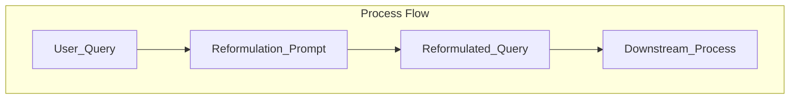

## LLM Evaluation

In addition to real-time or online monitoring of LLMs, Scouter provides you with tools to run offline LLM evaluations. This is is often useful for when you (1) want to compare and benchmark various prompts, and (2) you want to evaluate different versions of prompts and LLM services that you may already be using in production.

## Getting Started

To run and LLM evaluation, you will first need to obtain your evaluation data and construct a list of `LLMEvalRecord` instances. Each `LLMEvalRecord` represents a single evaluation instance, containing the metadata you wish to evaluate. Note, we have left this intentionally flexible so that you can evaluate any type of metadata you wish.

### Example: Creating Evaluation Records

Let's say you have a use case where you want to evaluate how well a prompt reformulates user search queries. The prompt used for this task is shown below and does the following things:

- Takes a bound parameter `${user_query}` which is the original user search query.
- Reformulates the query to be more feature-rich and keyword-dense, while preserving the original

```python
Prompt(
    message=(
        "You are an expert at query reformulation. Your task is to take a user's original search query "
        "and rewrite it to be more feature-rich and keyword-dense, so it better aligns with the user's intent "
        "and improves search results.\n\n"
        "Guidelines:\n"
        "- Expand abbreviations and clarify ambiguous terms.\n"
        "- Add relevant synonyms, related concepts, and specific features.\n"
        "- Preserve the original intent, but make the query more explicit and comprehensive.\n"
        "- Do not change the meaning of the query.\n"
        "- Return only the reformulated query.\n\n"
        "User Query:\n"
        "${user_query}\n\n"
        "Reformulated Query:"
    ),
    model="gemini-2.5-flash-lite",
    provider="gemini",
    model_settings=GeminiSettings(
        generation_config=GenerationConfig(
            thinking_config=ThinkingConfig(thinking_budget=0),
        ),
    ),
)
```
The overall flow for using the prompt would look like the following:



Now say you want to evaluate how well the prompt reformulates user queries into reformulated queries. In this scenario, imagine you already have a dataset of user queries and their reformulated queries that used the prompt above. Now, to evaluate the prompt, you would create a list of `LLMEvalRecords` containing the `user_query` and `reformulated_query` context as well as an `LLMEvalMetric` that defines how you want to evaluate the prompt using an `LLM as a judge` workflow.

Note: The `LLMEvalMetric` differs from the `LLMDriftMetric` in that the `LLMDriftMetric` is used when setting up real-time LLM monitoring and requires more configuration and setup. For offline evaluations, the `LLMEvalMetric` is simpler to use and requires less configuration. It requires only a name and eval prompt.

```python
from scouter.llm import Prompt, Score
from scouter.evaluate import LLMEvalMetric

reformulation_eval_prompt = Prompt(
    message=(
        "You are an expert evaluator of search query relevance. \n"
        "You will be given a user query and its reformulated version. \n"
        "You task is to assess how relevant the reformulated query is to the information needs of the user. \n"
        "Consider the following criteria:\n"
        "- Does the query contain relevant keywords and concepts?\n"
        "- Is the query clear and unambiguous?\n"
        "- Does the query adequately express the user's intent?\n\n"
        "Provide your evaluation as a JSON object with the following attributes:\n"
        "- score: An integer from 1 (poor) to 5 (excellent) indicating the overall reformulation score.\n"
        "- reason: A brief explanation for your score.\n\n"
        "Format your response as:\n"
        "{\n"
        '  "score": <integer 1-5>,\n'
        '  "reason": "<your explanation>"\n'
        "}\n\n"
        "User Query:\n"
        "${user_query}\n\n" #(1)
        "Reformulated Query:\n"
        "${reformulated_query}\n\n" #(2)
        "Evaluation:"
    ),
    model="gemini-2.5-flash-lite-preview-06-17",
    provider="gemini",
    response_format=Score, #(3)
)

eval_metric = LLMEvalMetric(
    name="reformulation_quality",
    prompt=reformulation_eval_prompt,
)
```

1. `${user_query}` is a bound parameter that will be populated from the `LLMEvalRecord` context
2. `${reformulated_query}` is a bound parameter that will be populated from the `LLMEvalRecord` context
3. `LLMEvalMetrics` currently require all prompts to return a `Score` object. This is critical as the score object allows us to extract a numerical score for evaluation.

