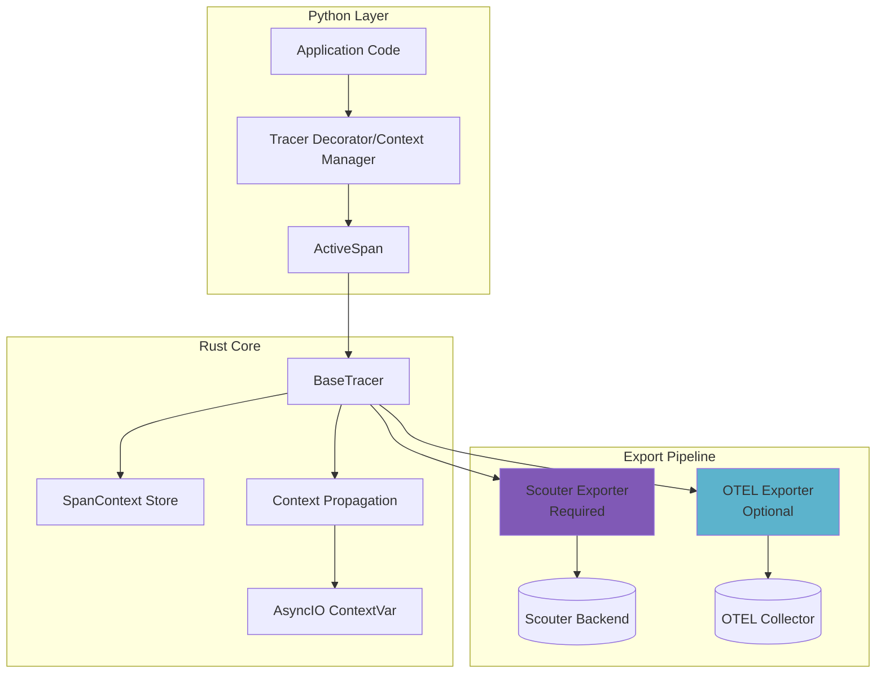
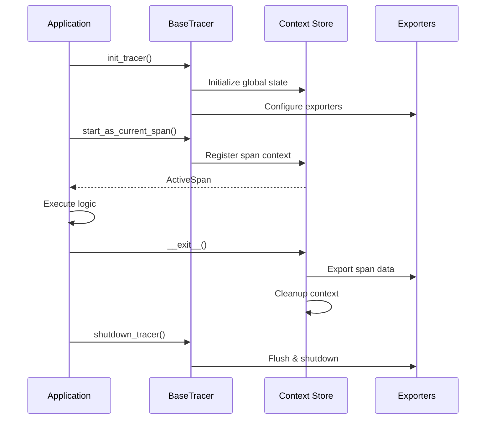

# Distributed Tracing

Scouter provides production-grade, OpenTelemetry-compatible distributed tracing built on Rust for performance with seamless Python integration. The system supports synchronous and asynchronous code, automatic context propagation, and dual-export capabilities to Scouter's backend and external OTEL collectors.

## Architecture



### Dual Export System

Every span is **always** exported to Scouter's backend while **optionally** exporting to external OTEL-compatible systems:

| Export Target | Purpose | Configuration |
|--------------|---------|---------------|
| **Scouter** (Required) | Correlation with models, drift profiles, events | `transport_config` |
| **OTEL Collector** (Optional) | Integration with existing observability stack | `exporter` |

## Core Components

### Initialization

=== "Scouter Only"

    ````python
    from scouter import init_tracer

    init_tracer(service_name="my-service")
    ````

=== "Scouter + OTEL Collector"

    ````python
    from scouter import (
        init_tracer,
        HttpConfig,
        HttpSpanExporter,
        OtelExportConfig
    )

    init_tracer(
        service_name="my-service",
        transport_config=HttpConfig(uri="http://scouter:8000"),
        exporter=HttpSpanExporter(
            export_config=OtelExportConfig(
                endpoint="http://otel-collector:4318"
            )
        )
    )
    ````

=== "Kafka Transport"

    ````python
    from scouter import init_tracer, KafkaConfig

    init_tracer(
        service_name="my-service",
        transport_config=KafkaConfig(brokers="kafka:9092")
    )
    ````

### Tracer Lifecycle



## Synchronous vs Asynchronous

Scouter's tracing system fully supports both synchronous and asynchronous code patterns in Python, ensuring seamless integration regardless of your application's architecture.

### Sync Functions

=== "Decorator"

    ````python
    from scouter.tracing import get_tracer

    # init_tracer(...) must be called beforehand
    tracer = get_tracer(name="sync-service")

    @tracer.span("process_data")
    def process_data(items: list[dict]) -> dict:  # (1)
        result = {"processed": len(items)}
        return result  # (2)
    ````

    1. Function arguments automatically captured as span input
    2. Return value captured as span output

=== "Context Manager"

    ````python
    from scouter.tracing import get_tracer

    tracer = get_tracer(name="sync-service")

    with tracer.start_as_current_span("manual_work") as span:
        span.set_attribute("worker_id", "123")
        perform_work()
        span.set_output({"status": "complete"})
    ````

### Async Functions

=== "Decorator"

    ````python
    from scouter.tracing import get_tracer

    tracer = get_tracer(name="async-service")

    @tracer.span("fetch_data")
    async def fetch_data(url: str) -> dict:
        async with httpx.AsyncClient() as client:
            response = await client.get(url)
            return response.json()
    ````

=== "Context Manager"

    ````python
    async def main():
        async with tracer.start_as_current_span("async_workflow") as span:
            span.set_tag("environment", "production")
            data = await fetch_data("https://api.example.com")
            span.set_output(data)
    ````

### Generators & Streaming

=== "Sync Generator"

    ````python
    from typing import Generator

    @tracer.span("stream_results", capture_last_stream_item=True)
    def stream_results(count: int) -> Generator[dict, None, None]:
        for i in range(count):
            yield {"index": i, "value": i ** 2} # (1)
    ````

    1. Last yielded item captured as span output

=== "Async Generator"

    ````python
    @tracer.span("async_stream", capture_last_stream_item=True)
    async def async_stream(count: int):
        for i in range(count):
            await asyncio.sleep(0.1)
            yield {"index": i}
    ````

## Context Propagation

### Within Process

Context automatically propagates through the call stack using Python's `contextvars`:

```python
@tracer.span("parent_operation")
def parent():
    child()  # (1)

@tracer.span("child_operation")
def child():
    pass  # (2)
```

1. Child automatically inherits parent's trace context
2. parent_span_id automatically set to parent's span_id

### Across Services

Extract trace headers from the current span and inject into downstream requests:

=== "Client Side"

````python
from scouter import get_tracing_headers_from_current_span

@tracer.span("service_a_request")
async def call_service_b():
    headers = get_tracing_headers_from_current_span()
    # (1)

    async with httpx.AsyncClient() as client:
        response = await client.post(
            "http://service-b/api/endpoint",
            headers=headers
        )
````

1. Returns `{"trace_id": "...", "span_id": "...", "is_sampled": "true"}`

=== "Server Side"

````python
from fastapi import Header

@app.post("/api/endpoint")
async def endpoint(
    trace_id: str = Header(None),
    span_id: str = Header(None),
    is_sampled: str = Header(None)
):
    with tracer.start_as_current_span(
        name="service_b_handler",
        trace_id=trace_id,
        span_id=span_id,  # (1)
        remote_sampled=is_sampled == "true"
    ) as span:
        span.set_tag("service", "service-b")
        return process_request()
````

1. Becomes the parent span ID, linking spans across services

## Span Attributes & Events

Spans can be enriched with attributes, tags, and events to provide additional context:

```python

from pydantic import BaseModel

class UserInput(BaseModel):
    user_id: int
    action: str
    metadata: dict

@tracer.span("process_user_action")
def handle_action(input: UserInput): # (1)
    with tracer.current_span as span:
        span.set_tag("user_id", str(input.user_id))
        span.set_attribute("action_type", input.action)

        span.add_event("validation_completed", {  # (2)
            "checks_passed": 5,
            "duration_ms": 23
        })
```

1. Pydantic models automatically serialized
2. Add structured events to spans for detailed observability

### Tags vs Attributes

!!! info "Understanding Tags"

Tags are indexed attributes designed for efficient searching. They're stored in a separate backend table and prefixed with scouter.tag.* during export

**Note:** Attributes are the OTEL preferred way to store general metadata; however, Scouter uses tags for key metadata that users frequently filter/search on.

```python
with tracer.start_as_current_span("api_request") as span:
    # Tags - indexed for search/filtering
    span.set_tag("environment", "production")  # (1)
    span.set_tag("customer_tier", "enterprise")
    
    # Attributes - general metadata
    span.set_attribute("request_size_bytes", 1024)  # (2)
    span.set_attribute("cache_hit", True)
```

1. Stored as scouter.tag.environment in backend
2. Stored as regular attributes

## Span Kinds & Labels

### Span Kinds

Use semantic span kinds for better trace visualization:

```python
from scouter.tracing import SpanKind

# Server receiving request
with tracer.start_as_current_span("handle_request", kind=SpanKind.Server):
    process_request()

# Client making request
with tracer.start_as_current_span("call_api", kind=SpanKind.Client):
    httpx.get("https://api.example.com")

# Producer publishing message
with tracer.start_as_current_span("publish_event", kind=SpanKind.Producer):
    kafka_producer.send(...)

# Consumer processing message
with tracer.start_as_current_span("consume_event", kind=SpanKind.Consumer):
    handle_message(...)
```

### Labels

Categorize spans for organizational purposes

```python
@tracer.span("train_model", label="ml-training")
def train_model():
    pass

@tracer.span("validate_input", label="data-validation")
def validate():
    pass
```


## Error Handling

Exceptions are automatically captured with full tracebacks:

```python

@tracer.span("risky_operation")
def process():
    try:
        might_fail()
    except ValueError as e: # (1)
        raise
```

1. Exception automatically recorded with type, value, and full traceback. Span status set to ERROR

## Real-time Monitoring

In addition to standard span methods, Scouter provides additional convenience methods for real-time monitoring and inserting entity records into queues. This is especially useful for apis in which you wish to correlate traces and drift detection/evaluation records.

```python

from scouter.queue import ScouterQueue
from scouter.tracing import get_tracer, init_tracer

# usually called once at app startup
init_tracer(service_name="monitoring-service")


# example fastapi lifespan
@asynccontextmanager
async def lifespan(app: FastAPI):
    logger.info("Starting up FastAPI app")

    # get tracer
    tracer = get_tracer(name="monitoring-service")

    queue ScouterQueue.from_path(
        path={"genai": Path(...)},
        transport_config=GrpcConfig(),
    )

    # set the queue on the tracer
    tracer.set_scouter_queue(queue)

    yield

    logger.info("Shutting down FastAPI app")
    queue.shutdown()
    tracer.shutdown()


def monitoring_task():
    with tracer.start_as_current_span("monitoring_task") as span:
        # insert items into queue with the span
        span.insert_queue_item(
            "alias",  # (1)
            GenAIEvaluationRecord(...) # (2)
        )
```

1. Alias to identify the queue
2. Any Scouter entity record type can be inserted into the queue

## Performance Considerations


### Sampling

Control trace sampling rates to balance performance and observability

Each OTEL exporter can be instantiated with a sampling ratio between 0.0 and 1.0:

```python
from scouter.tracing import init_tracer, HttpSpanExporter, GrpcSpanExporter

init_tracer(
    service_name="sampled-service",
    exporter=HttpSpanExporter(
        sample_ratio=0.25,  # (1)
    )
)

init_tracer(
    service_name="sampled-service-grpc",
    exporter=GrpcSpanExporter(
        sample_ratio=0.25,
    )
)
```

1. 25% of spans exported to OTEL collector

!!! note

    Sample ratio in the above example only affects the OTEL exporter. If you wish to enforce the same sampling ratio for both Scouter and OTEL exporters, you must set the `sample_ratio` parameter in the init_tracer function directly.


**Enforce Global Sampling Ratio** for both Scouter and OTEL exporters:

```python
from scouter import init_tracer, HttpSpanExporter

init_tracer(
    service_name="globally-sampled-service",
    sample_ratio=0.1,  # (1)
    exporter=HttpSpanExporter()
)
```

1. 10% of spans exported to both Scouter and OTEL collector. This overrides individual exporter sampling ratios.

### Batch Export

Scouter provides a BatchConfig to optimize span exporting:

**Batch is enabled by default.** Customize batch settings as needed:

```python
from scouter.tracing import BatchConfig, init_tracer, GrpcSpanExporter

init_tracer(
    service_name="high-throughput-service",
    batch_config=BatchConfig(
        max_queue_size=4096,
        scheduled_delay_ms=1000,  # (1)
        max_export_batch_size=1024
    ),
    exporter=GrpcSpanExporter(batch_export=True) # (2)

)

init_tracer(
    service_name="high-throughput-service",
    exporter=GrpcSpanExporter(batch_export=True) # (3)

)
```

1. Export spans every 1 second in batches
2. Ensure exporter is set to batch mode (default is True)
3. Exporter uses default batch settings if not specified


### Input/output Truncation
Large span inputs/outputs can be truncated to reduce payload size:

```python
@tracer.span("process_large_data")
def process(data: str): # (1)
    pass

# Manual truncation control
with tracer.start_as_current_span("manual") as span:
    span.set_input(large_object, max_length=10000)  # (2)
```
1. Automatically truncates inputs/outputs exceeding 5000 characters
2. Manually specify max length for input/output serialization