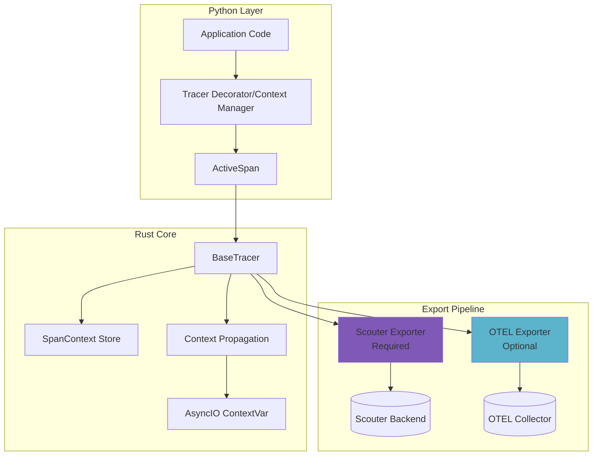
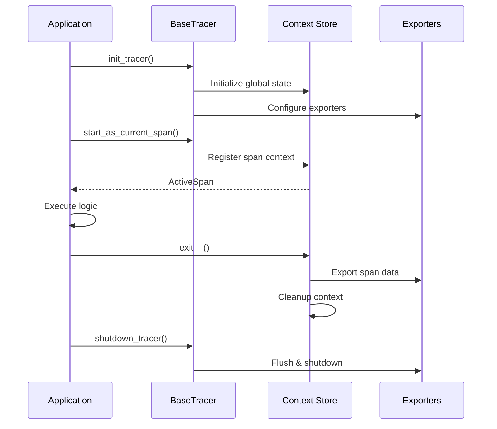

# Distributed Tracing

Scouter provides OpenTelemetry-compatible distributed tracing built on Rust with a Python interface. The system supports synchronous and asynchronous code, automatic context propagation, and dual-export to Scouter's backend and external OTEL collectors.

Traces captured by Scouter can be evaluated offline or in production using [`TraceAssertionTask`](/scouter/docs/monitoring/genai/tasks/#traceassertionask) — validating span execution order, latency SLAs, token budgets, and more.

## Architecture


```mermaid
graph TB
    subgraph "Python Layer"
        A[Application Code] --> B[Tracer Decorator/Context Manager]
        B --> C[ActiveSpan]
    end

    subgraph "Rust Core"
        C --> D[BaseTracer]
        D --> E[SpanContext Store]
        D --> F[Context Propagation]
        F --> G[AsyncIO ContextVar]
    end

    subgraph "Export Pipeline"
        D --> H[Scouter Exporter<br/>Required]
        D --> I[OTEL Exporter<br/>Optional]
        H --> J[(Scouter Backend)]
        I --> K[(OTEL Collector)]
    end

    style H fill:#8059b6
    style I fill:#5cb3cc
```

### Dual Export System

Every span is **always** exported to Scouter's backend while **optionally** exporting to external OTEL-compatible systems:

| Export Target | Purpose | Configuration |
|--------------|---------|---------------|
| **Scouter** (Required) | Correlation with models, drift profiles, events | `transport_config` |
| **OTEL Collector** (Optional) | Integration with existing observability stack | `exporter` |

## Core Components

### Initialization

=== "Scouter Only"

    ````python
    from scouter import init_tracer

    init_tracer(service_name="my-service")
    ````

=== "Scouter + OTEL Collector"

    ````python
    from scouter import (
        init_tracer,
        HttpConfig,
        HttpSpanExporter,
        OtelExportConfig
    )

    init_tracer(
        service_name="my-service",
        transport_config=HttpConfig(uri="http://scouter:8000"),
        exporter=HttpSpanExporter(
            export_config=OtelExportConfig(
                endpoint="http://otel-collector:4318"
            )
        )
    )
    ````

=== "Kafka Transport"

    ````python
    from scouter import init_tracer, KafkaConfig

    init_tracer(
        service_name="my-service",
        transport_config=KafkaConfig(brokers="kafka:9092")
    )
    ````

### Tracer Lifecycle


```mermaid
sequenceDiagram
    participant App as Application
    participant Tracer as BaseTracer
    participant Store as Context Store
    participant Exp as Exporters

    App->>Tracer: init_tracer()
    Tracer->>Store: Initialize global state
    Tracer->>Exp: Configure exporters

    App->>Tracer: start_as_current_span()
    Tracer->>Store: Register span context
    Store-->>App: ActiveSpan

    App->>App: Execute logic

    App->>Store: __exit__()
    Store->>Exp: Export span data
    Store->>Store: Cleanup context

    App->>Tracer: shutdown_tracer()
    Tracer->>Exp: Flush & shutdown
```

## OpenTelemetry Compatibility

Scouter's tracing layer is built on top of the OpenTelemetry SDK. You can use Scouter as a drop-in `TracerProvider` in any OTEL-instrumented application.

### ScouterInstrumentor

`ScouterInstrumentor` implements the standard OpenTelemetry `BaseInstrumentor` interface. It registers Scouter's `TracerProvider` as the global OTEL provider, so any library that calls `opentelemetry.trace.get_tracer()` will route spans through Scouter automatically.

`ScouterInstrumentor` is a singleton — calling it multiple times returns the same instance.

Full API reference, framework integration examples (OpenAI Agents SDK, LangChain, LlamaIndex, CrewAI, FastAPI), default attributes, and local span capture patterns are covered in the [ScouterInstrumentor guide](/scouter/docs/tracing/instrumentor/).

```python
from scouter.tracing import ScouterInstrumentor

instrumentor = ScouterInstrumentor()
instrumentor.instrument()
```

This is equivalent to calling the convenience function:

```python
from scouter.tracing import instrument

instrument()
```

**With transport and batch configuration:**

```python
from scouter.tracing import ScouterInstrumentor
from scouter import GrpcConfig, BatchConfig

ScouterInstrumentor().instrument(
    transport_config=GrpcConfig(),
    batch_config=BatchConfig(scheduled_delay_ms=200),
)
```

**With an external OTEL collector:**

```python
from scouter.tracing import ScouterInstrumentor, HttpSpanExporter, OtelExportConfig

ScouterInstrumentor().instrument(
    transport_config=GrpcConfig(),
    exporter=HttpSpanExporter(
        export_config=OtelExportConfig(endpoint="http://otel-collector:4318")
    ),
)
```

**Check instrumentation status:**

```python
instrumentor = ScouterInstrumentor()
print(instrumentor.is_instrumented)  # True / False
```

**Tear down instrumentation:**

```python
ScouterInstrumentor().uninstrument()
```

`uninstrument()` flushes pending spans, shuts down the provider, and resets the global OTEL tracer provider. The singleton is also reset, so the next call to `ScouterInstrumentor()` creates a fresh instance.

### ScouterInstrumentor vs init_tracer

Both paths initialize Scouter tracing and produce identical span output. The difference is integration scope:

| | `init_tracer()` | `ScouterInstrumentor` |
|--|-----------------|----------------------|
| Registers global OTEL provider | No | Yes |
| Works with OTEL auto-instrumentation libraries | No | Yes |
| Idiomatic for greenfield Scouter-only code | Yes | No |
| Follows OTel `BaseInstrumentor` lifecycle | No | Yes |

Use `ScouterInstrumentor` when your application uses OTEL auto-instrumentation libraries (e.g., `opentelemetry-instrumentation-fastapi`, `opentelemetry-instrumentation-httpx`) and you want their spans to flow through Scouter. Use `init_tracer()` for simpler setups where you instrument everything manually.

### Using Scouter as a TracerProvider

You can construct a `TracerProvider` directly and set it as the global provider:

```python
from opentelemetry import trace
from opentelemetry.sdk.trace.export import set_tracer_provider
from scouter.tracing import TracerProvider
from scouter import GrpcConfig

provider = TracerProvider(transport_config=GrpcConfig())
set_tracer_provider(provider)

# Any OTEL-instrumented library now routes spans through Scouter
tracer = trace.get_tracer(__name__)
with tracer.start_as_current_span("my-span") as span:
    span.set_attribute("key", "value")
```

## Synchronous vs Asynchronous

Scouter's tracing system fully supports both synchronous and asynchronous code patterns in Python, ensuring seamless integration regardless of your application's architecture.

### Sync Functions

=== "Decorator"

    ````python
    from scouter.tracing import get_tracer

    # init_tracer(...) must be called beforehand
    tracer = get_tracer(name="sync-service")

    @tracer.span("process_data")
    def process_data(items: list[dict]) -> dict:  # (1)
        result = {"processed": len(items)}
        return result  # (2)
    ````

    1. Function arguments automatically captured as span input
    2. Return value captured as span output

=== "Context Manager"

    ````python
    from scouter.tracing import get_tracer

    tracer = get_tracer(name="sync-service")

    with tracer.start_as_current_span("manual_work") as span:
        span.set_attribute("worker_id", "123")
        perform_work()
        span.set_output({"status": "complete"})
    ````

### Async Functions

=== "Decorator"

    ````python
    from scouter.tracing import get_tracer

    tracer = get_tracer(name="async-service")

    @tracer.span("fetch_data")
    async def fetch_data(url: str) -> dict:
        async with httpx.AsyncClient() as client:
            response = await client.get(url)
            return response.json()
    ````

=== "Context Manager"

    ````python
    async def main():
        async with tracer.start_as_current_span("async_workflow") as span:
            span.set_tag("environment", "production")
            data = await fetch_data("https://api.example.com")
            span.set_output(data)
    ````

### Generators & Streaming

=== "Sync Generator"

    ````python
    from typing import Generator

    @tracer.span("stream_results", capture_last_stream_item=True)
    def stream_results(count: int) -> Generator[dict, None, None]:
        for i in range(count):
            yield {"index": i, "value": i ** 2} # (1)
    ````

    1. Last yielded item captured as span output

=== "Async Generator"

    ````python
    @tracer.span("async_stream", capture_last_stream_item=True)
    async def async_stream(count: int):
        for i in range(count):
            await asyncio.sleep(0.1)
            yield {"index": i}
    ````

## Context Propagation

### Within Process

Context automatically propagates through the call stack using Python's `contextvars`:

```python
@tracer.span("parent_operation")
def parent():
    child()  # (1)

@tracer.span("child_operation")
def child():
    pass  # (2)
```

1. Child automatically inherits parent's trace context
2. parent_span_id automatically set to parent's span_id

### Across services

`get_tracing_headers_from_current_span()` returns a dict containing the W3C `traceparent` header (plus `tracestate` and `baggage` when present) for the currently active span. Pass it directly in outbound requests.

On the receiving end, `ScouterTracingMiddleware` handles extraction. It reads the `traceparent` header on every inbound request and opens a `SERVER` span as the parent — so spans you create inside route handlers are already children of the upstream caller's span, with the correct `trace_id` and `parent_span_id` set.

=== "Client (orchestrator)"

````python
from scouter.tracing import get_tracing_headers_from_current_span

async with httpx.AsyncClient() as client:
    with tracer.start_as_current_span("orchestrator.greet") as span:
        # Returns W3C traceparent headers for the active span.
        propagation_headers = get_tracing_headers_from_current_span()

        response = await client.get(
            "http://service-b/hello",
            params={"name": "Alice"},
            headers=propagation_headers,
        )
````

=== "Server (downstream service)"

````python
from fastapi import FastAPI
from scouter.tracing import ScouterTracingMiddleware

app = FastAPI(lifespan=lifespan)

# Middleware runs before every route handler.
# It extracts traceparent and opens a SERVER span automatically.
app.add_middleware(ScouterTracingMiddleware, tracer=tracer)

@app.get("/hello")
async def hello(name: str = "World") -> dict:
    # The active span here is already a child of the orchestrator's span.
    # No manual header parsing needed.
    with tracer.start_as_current_span("hello.build_greeting") as span:
        span.set_attribute("greeting.name", name)
        return {"message": f"Hello, {name}!"}
````

!!! tip "Automatic header injection"
    `instrument()` registers a W3C `TraceContext + Baggage` propagator as the global OTel `TextMapPropagator`. Install `opentelemetry-instrumentation-httpx` and call `HTTPXInstrumentor().instrument()` to skip the manual `get_tracing_headers_from_current_span()` call — headers are injected automatically on every outbound request.

### Multi-service example

The `examples/tracing/` directory contains a working 3-service setup: an orchestrator that fans out to a hello service and a goodbye service, all linked in a single distributed trace.

```
orchestrator.greet            [orchestrator-service]  root
├── GET /hello                [hello-service]         child
│   └── hello.build_greeting  [hello-service]         grandchild
└── GET /goodbye              [goodbye-service]       child
    └── goodbye.build_farewell [goodbye-service]      grandchild
```

Start all three services and send a demo request:

```bash
bash examples/tracing/run_example.sh
# or from py-scouter/:
make example.tracing
```

The script starts each service, waits for readiness, sends a `POST /greet` request, and prints the resulting trace ID. Use that ID to query the full span tree from the Scouter client:

```python
scouter_client.get_trace_spans_from_filters(TraceFilters(trace_id="<trace_id>"))
```

Individual services can also be started in isolation for debugging:

```bash
make example.tracing.hello        # port 8081
make example.tracing.goodbye      # port 8082
make example.tracing.orchestrator # port 8083
```

## Span Attributes & Events

Spans can be enriched with attributes, tags, and events to provide additional context:

```python

from pydantic import BaseModel

class UserInput(BaseModel):
    user_id: int
    action: str
    metadata: dict

@tracer.span("process_user_action")
def handle_action(input: UserInput): # (1)
    with tracer.current_span as span:
        span.set_tag("user_id", str(input.user_id))
        span.set_attribute("action_type", input.action)

        span.add_event("validation_completed", {  # (2)
            "checks_passed": 5,
            "duration_ms": 23
        })
```

1. Pydantic models automatically serialized
2. Add structured events to spans for detailed observability

### Tags vs Attributes

!!! info "Understanding Tags"

Tags are indexed attributes designed for efficient searching. They're stored in a separate backend table and prefixed with scouter.tag.* during export

**Note:** Attributes are the OTEL preferred way to store general metadata; however, Scouter uses tags for key metadata that users frequently filter/search on.

```python
with tracer.start_as_current_span("api_request") as span:
    # Tags - indexed for search/filtering
    span.set_tag("environment", "production")  # (1)
    span.set_tag("customer_tier", "enterprise")
    
    # Attributes - general metadata
    span.set_attribute("request_size_bytes", 1024)  # (2)
    span.set_attribute("cache_hit", True)
```

1. Stored as scouter.tag.environment in backend
2. Stored as regular attributes

## Span Kinds & Labels

### Span Kinds

Use semantic span kinds for better trace visualization:

```python
from scouter.tracing import SpanKind

# Server receiving request
with tracer.start_as_current_span("handle_request", kind=SpanKind.Server):
    process_request()

# Client making request
with tracer.start_as_current_span("call_api", kind=SpanKind.Client):
    httpx.get("https://api.example.com")

# Producer publishing message
with tracer.start_as_current_span("publish_event", kind=SpanKind.Producer):
    kafka_producer.send(...)

# Consumer processing message
with tracer.start_as_current_span("consume_event", kind=SpanKind.Consumer):
    handle_message(...)
```

### Labels

Categorize spans for organizational purposes

```python
@tracer.span("train_model", label="ml-training")
def train_model():
    pass

@tracer.span("validate_input", label="data-validation")
def validate():
    pass
```


## Error Handling

Exceptions are automatically captured with full tracebacks:

```python

@tracer.span("risky_operation")
def process():
    try:
        might_fail()
    except ValueError as e: # (1)
        raise
```

1. Exception automatically recorded with type, value, and full traceback. Span status set to ERROR

## Real-time Monitoring

In addition to standard span methods, Scouter provides additional convenience methods for real-time monitoring and inserting entity records into queues. This is especially useful for apis in which you wish to correlate traces and drift detection/evaluation records.

```python

from scouter.queue import ScouterQueue
from scouter.tracing import get_tracer, init_tracer

# usually called once at app startup
init_tracer(service_name="monitoring-service")


# example fastapi lifespan
@asynccontextmanager
async def lifespan(app: FastAPI):
    logger.info("Starting up FastAPI app")

    # get tracer
    tracer = get_tracer(name="monitoring-service")

    queue ScouterQueue.from_path(
        path={"agent": Path(...)},
        transport_config=GrpcConfig(),
    )

    # set the queue on the tracer
    tracer.set_scouter_queue(queue)

    yield

    logger.info("Shutting down FastAPI app")
    queue.shutdown()
    tracer.shutdown()


def monitoring_task():
    with tracer.start_as_current_span("monitoring_task") as span:
        # insert items into queue with the span
        span.insert_queue_item(
            "alias",  # (1)
            EvalRecord(...) # (2)
        )
```

1. Alias to identify the queue
2. Any Scouter entity record type can be inserted into the queue

## Performance Considerations


### Sampling

Control trace sampling rates to balance performance and observability

Each OTEL exporter can be instantiated with a sampling ratio between 0.0 and 1.0:

```python
from scouter.tracing import init_tracer, HttpSpanExporter, GrpcSpanExporter

init_tracer(
    service_name="sampled-service",
    exporter=HttpSpanExporter(
        sample_ratio=0.25,  # (1)
    )
)

init_tracer(
    service_name="sampled-service-grpc",
    exporter=GrpcSpanExporter(
        sample_ratio=0.25,
    )
)
```

1. 25% of spans exported to OTEL collector

!!! note

    Sample ratio in the above example only affects the OTEL exporter. If you wish to enforce the same sampling ratio for both Scouter and OTEL exporters, you must set the `sample_ratio` parameter in the init_tracer function directly.


**Enforce Global Sampling Ratio** for both Scouter and OTEL exporters:

```python
from scouter import init_tracer, HttpSpanExporter

init_tracer(
    service_name="globally-sampled-service",
    sample_ratio=0.1,  # (1)
    exporter=HttpSpanExporter()
)
```

1. 10% of spans exported to both Scouter and OTEL collector. This overrides individual exporter sampling ratios.

### Batch Export

Scouter provides a BatchConfig to optimize span exporting:

**Batch is enabled by default.** Customize batch settings as needed:

```python
from scouter.tracing import BatchConfig, init_tracer, GrpcSpanExporter

init_tracer(
    service_name="high-throughput-service",
    batch_config=BatchConfig(
        max_queue_size=4096,
        scheduled_delay_ms=1000,  # (1)
        max_export_batch_size=1024
    ),
    exporter=GrpcSpanExporter(batch_export=True) # (2)

)

init_tracer(
    service_name="high-throughput-service",
    exporter=GrpcSpanExporter(batch_export=True) # (3)

)
```

1. Export spans every 1 second in batches
2. Ensure exporter is set to batch mode (default is True)
3. Exporter uses default batch settings if not specified


### Input/output Truncation
Large span inputs/outputs can be truncated to reduce payload size:

```python
@tracer.span("process_large_data")
def process(data: str): # (1)
    pass

# Manual truncation control
with tracer.start_as_current_span("manual") as span:
    span.set_input(large_object, max_length=10000)  # (2)
```
1. Automatically truncates inputs/outputs exceeding 5000 characters
2. Manually specify max length for input/output serialization