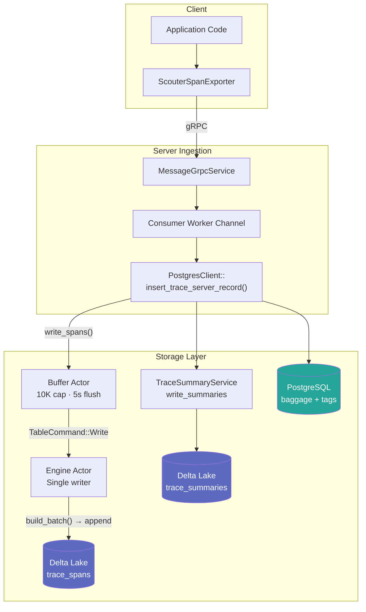
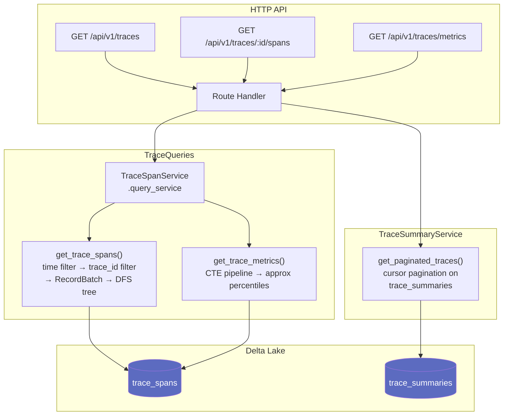

# Trace Storage Architecture

Scouter's server stores OTel spans in a **Delta Lake + Apache DataFusion** columnar engine, replacing Postgres-only trace storage. Spans are ingested at high throughput via a dual-actor write pipeline and queried via DataFusion SQL — giving you sub-second reads, efficient compaction, and cloud-native object store support.

---

## Write Path



Every span batch arriving via gRPC is processed by `insert_trace_server_record`, which fans out to three destinations simultaneously:

1. **Delta Lake `trace_spans`** — full span data via the dual-actor pipeline
2. **Delta Lake `trace_summaries`** — one row per trace, updated as spans arrive
3. **PostgreSQL** — baggage and tag metadata (retained for indexed search)

---

## Query Path



---

## Component Reference

| Component | Crate | File | Purpose |
|-----------|-------|------|---------|
| `TraceSpanService` | `scouter_dataframe` | `parquet/tracing/service.rs` | Global singleton; owns both actors and the query service |
| `TraceSpanDBEngine` | `scouter_dataframe` | `parquet/tracing/engine.rs` | Delta Lake single-writer actor |
| `TraceSpanBatchBuilder` | `scouter_dataframe` | `parquet/tracing/engine.rs` | Zero-copy Arrow serialization of `TraceSpanRecord` |
| `TraceQueries` | `scouter_dataframe` | `parquet/tracing/queries.rs` | DataFusion query execution and DFS span tree assembly |
| `TraceSummaryService` | `scouter_dataframe` | `parquet/tracing/summary.rs` | Hour-bucketed summary table with cursor pagination |
| `MessageGrpcService` | `scouter_server` | `api/grpc/message.rs` | gRPC ingestion handler |
| `PostgresClient` | `scouter_sql` | `sql/postgres.rs` | Consumer worker; routes spans to services via `insert_trace_server_record` |

---

## Write Path: Dual-Actor Design

`TraceSpanService` starts two long-lived Tokio tasks on initialization:

### Buffer Actor

Collects incoming `TraceSpanRecord` batches in memory and triggers a flush when either condition is met:

- **Capacity**: buffer reaches 10,000 spans
- **Time**: flush interval elapses (default: 5 seconds, configurable via `SCOUTER_TRACE_FLUSH_INTERVAL_SECS`)

On flush, the buffer actor drains itself and sends a `TableCommand::Write` message to the engine actor, then awaits acknowledgment via a oneshot channel.

### Engine Actor

The single writer for the Delta Lake table. It:

1. Receives `TableCommand::Write { spans, respond_to }`
2. Calls `build_batch()` on `TraceSpanBatchBuilder` to produce an Arrow `RecordBatch`
3. Calls `write_spans()` — acquires a write lock, refreshes the table state, appends the batch
4. Re-registers the updated table in the shared `SessionContext` so queries immediately see new data
5. Sends `Ok(())` back on the oneshot channel

**Why this pattern?** Delta Lake requires a single writer per table to avoid log conflicts. The two-actor design amortizes object-store I/O (many small span batches → fewer larger Parquet files per flush) while keeping the write lock duration minimal.

The engine actor also runs automatic compaction via an internal `tokio::time::interval` ticker:

```
loop {
    select! {
        cmd = rx.recv()          => handle Write / Optimize / Vacuum / Shutdown
        _ = compaction_ticker    => run Z-ORDER optimize automatically
    }
}
```

---

## Schema Design

### `trace_spans` (23 columns)

Stores one row per span. Hierarchy fields (`depth`, `span_order`, `path`, `root_span_id`) are **not stored** — they are computed at query time by `build_span_tree()` via Rust DFS traversal. This matches the Jaeger/Zipkin model and avoids ordering dependencies during ingest (spans may arrive out-of-order within a batch).

| Column | Arrow Type | Nullable | Notes |
|--------|-----------|----------|-------|
| `trace_id` | `FixedSizeBinary(16)` | No | W3C 128-bit trace ID |
| `span_id` | `FixedSizeBinary(8)` | No | W3C 64-bit span ID |
| `parent_span_id` | `FixedSizeBinary(8)` | Yes | Null on root spans |
| `flags` | `Int32` | No | W3C trace flags |
| `trace_state` | `Utf8` | No | W3C trace state header |
| `scope_name` | `Utf8` | No | Instrumentation scope |
| `scope_version` | `Utf8` | Yes | Instrumentation scope version |
| `service_name` | `Dictionary<Int32, Utf8>` | No | Dictionary-encoded; high repetition |
| `span_name` | `Utf8` | No | Operation name |
| `span_kind` | `Dictionary<Int8, Utf8>` | Yes | Dictionary-encoded; SERVER/CLIENT/etc. |
| `start_time` | `Timestamp(Microsecond, UTC)` | No | Sub-millisecond precision |
| `end_time` | `Timestamp(Microsecond, UTC)` | No | Sub-millisecond precision |
| `duration_ms` | `Int64` | No | Pre-computed for fast aggregation |
| `status_code` | `Int32` | No | OTel status code (0=Unset, 1=OK, 2=Error) |
| `status_message` | `Utf8` | Yes | |
| `label` | `Utf8` | Yes | Scouter-specific span label |
| `attributes` | `Map<Utf8, Utf8View>` | No | Key-value span attributes |
| `resource_attributes` | `Map<Utf8, Utf8View>` | Yes | Resource-level attributes |
| `events` | `List<Struct{name, timestamp, attributes, dropped_count}>` | No | Span events |
| `links` | `List<Struct{trace_id, span_id, trace_state, attributes, dropped_count}>` | No | Span links |
| `input` | `Utf8View` | Yes | Captured function input (JSON) |
| `output` | `Utf8View` | Yes | Captured function output (JSON) |
| `search_blob` | `Utf8View` | No | Pre-computed search string |

**Key design decisions:**

| Decision | Rationale |
|----------|-----------|
| Hierarchy not stored | Avoids ordering dependencies during ingest; DFS is computed in Rust at query time |
| `Dictionary` on `service_name`, `span_kind` | High repetition across spans → significant compression savings |
| `Utf8View` for `input`, `output`, `search_blob` | Large JSON payloads; Arrow `StringView` reduces heap copies for long strings |
| `search_blob` pre-computed at ingest | Concatenates service name, span name, scope name, attributes, and events into a single string — avoids JSON re-parsing on every attribute filter query |
| `Timestamp(Microsecond, UTC)` | Sub-millisecond precision with explicit timezone; matches OTel wire format |
| `FixedSizeBinary` for IDs | Compact binary representation; avoids hex string parsing in hot path |

### `trace_summaries` (14 columns)

Stores one row per trace, hour-bucketed. Used exclusively for the paginated trace list — avoiding a full `trace_spans` scan for list views.

| Column | Arrow Type | Nullable |
|--------|-----------|----------|
| `trace_id` | `FixedSizeBinary(16)` | No |
| `service_name` | `Dictionary<Int32, Utf8>` | No |
| `scope_name` | `Utf8` | No |
| `scope_version` | `Utf8` | Yes |
| `root_operation` | `Utf8` | No |
| `start_time` | `Timestamp(Microsecond, UTC)` | No |
| `end_time` | `Timestamp(Microsecond, UTC)` | Yes |
| `duration_ms` | `Int64` | Yes |
| `status_code` | `Int32` | No |
| `status_message` | `Utf8` | Yes |
| `span_count` | `Int64` | No |
| `error_count` | `Int64` | No |
| `resource_attributes` | `Utf8` | Yes |

---

## Query Path Details

### `get_trace_spans`

Retrieves all spans for a single trace and assembles them into a hierarchy tree.

1. **Time filter applied first** — enables Delta Lake statistics-based file pruning (skips Parquet files whose `start_time` range doesn't overlap the query window)
2. **`trace_id` filter** — binary equality pushdown
3. **`RecordBatch` → `FlatSpan`** — zero-copy column extraction from Arrow arrays
4. **`build_span_tree()`** — Rust DFS traversal assigns `depth`, `span_order`, `path`, and `root_span_id` in-memory; orphan spans (parent not in batch) are appended at the end

### `get_trace_metrics`

Returns time-bucketed aggregates using a DataFusion CTE pipeline:

```sql
WITH
  -- Optional: pre-filter by attribute (LIKE on search_blob)
  matching_traces AS (
    SELECT DISTINCT trace_id FROM trace_spans
    WHERE start_time >= ? AND start_time < ?
    AND (search_blob LIKE '%key:value%' OR ...)
  ),
  -- Aggregate per-trace: duration = MAX(end_time) - MIN(start_time)
  trace_level AS (
    SELECT trace_id, MIN(start_time), MAX(end_time),
           MAX(CASE WHEN parent_span_id IS NULL THEN service_name END) AS root_service,
           MAX(status_code)
    FROM trace_spans WHERE ... GROUP BY trace_id
  ),
  service_filtered AS (...),
  bucketed AS (SELECT DATE_TRUNC('hour', trace_start), duration_ms, status_code ...)
SELECT
  bucket_start,
  COUNT(*) AS trace_count,
  AVG(duration_ms), approx_percentile_cont(duration_ms, 0.50),
  approx_percentile_cont(duration_ms, 0.95),
  approx_percentile_cont(duration_ms, 0.99),
  AVG(CASE WHEN status_code = 2 THEN 1.0 ELSE 0.0 END) AS error_rate
FROM bucketed GROUP BY bucket_start ORDER BY bucket_start
```

Attribute filters use `search_blob LIKE '%key:value%'` — no JSON parsing at query time.

### `get_paginated_traces`

Reads from `trace_summaries` using cursor-based pagination on `(start_time, trace_id)`. The cursor avoids full table scans on large datasets:

- **Forward**: `(start_time, trace_id) < (cursor_start, cursor_id) LIMIT n`
- **Backward**: `(start_time, trace_id) > (cursor_start, cursor_id) LIMIT n` (then reverse)

---

## Compaction and Maintenance

Trace data goes through a three-phase lifecycle:

### 1. Flush

The buffer actor writes small Parquet files on every flush (every 10K spans or 5 seconds). File sizes depend on span payload sizes but are typically small immediately after ingest.

### 2. Compaction (Z-ORDER)

The engine actor runs compaction automatically on a configurable interval (default: every 24 hours). Compaction uses Delta Lake Z-ORDER on `(start_time, service_name)`:

- **Target file size**: 128 MB
- **Z-ORDER columns**: `start_time` (time-range queries), `service_name` (service filter pushdown)

Z-ORDER co-locates spans with similar start times and service names within each Parquet file, maximizing the effectiveness of DataFusion's min/max statistics-based file pruning.

### 3. Vacuum

Removes old Parquet file versions that are no longer referenced by the Delta log, freeing object storage space. Vacuum honors the configured retention window before deleting files.

Both compaction and vacuum can also be triggered on-demand via `TraceSpanService::optimize()` and `TraceSpanService::vacuum(retention_hours)`.

---

## Configuration

| Environment Variable | Default | Description |
|---------------------|---------|-------------|
| `SCOUTER_STORAGE_URI` | `./scouter_storage` | Object store root. Supports `s3://`, `gs://`, `az://`, or local path |
| `SCOUTER_TRACE_COMPACTION_INTERVAL_HOURS` | `24` | How often automatic Z-ORDER compaction runs |
| `SCOUTER_TRACE_FLUSH_INTERVAL_SECS` | `5` | How often the span buffer flushes to Delta Lake |
| `AWS_REGION` | `us-east-1` | Required when using S3 storage |

---

## Storage Backends

The storage layer uses the `ObjectStore` abstraction, supporting all major cloud providers and local filesystems with no code changes:

| Backend | URI Prefix | Notes |
|---------|-----------|-------|
| Local filesystem | `./path` or `/abs/path` | Default; good for development |
| Amazon S3 | `s3://bucket/prefix` | Requires `AWS_REGION` and standard AWS credentials |
| Google Cloud Storage | `gs://bucket/prefix` | Uses Application Default Credentials |
| Azure Blob Storage | `az://container/prefix` | Uses standard Azure SDK credentials |

The same Delta Lake protocol and DataFusion query engine run identically across all backends.
